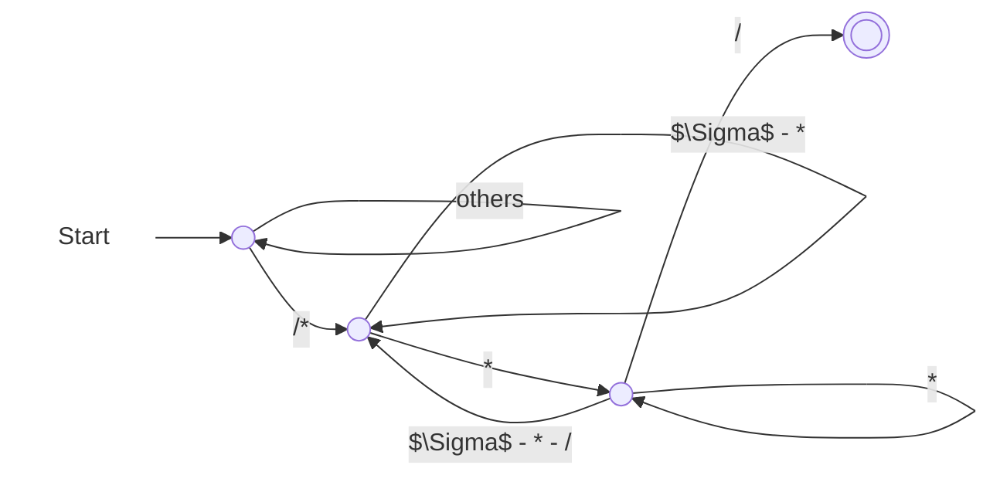
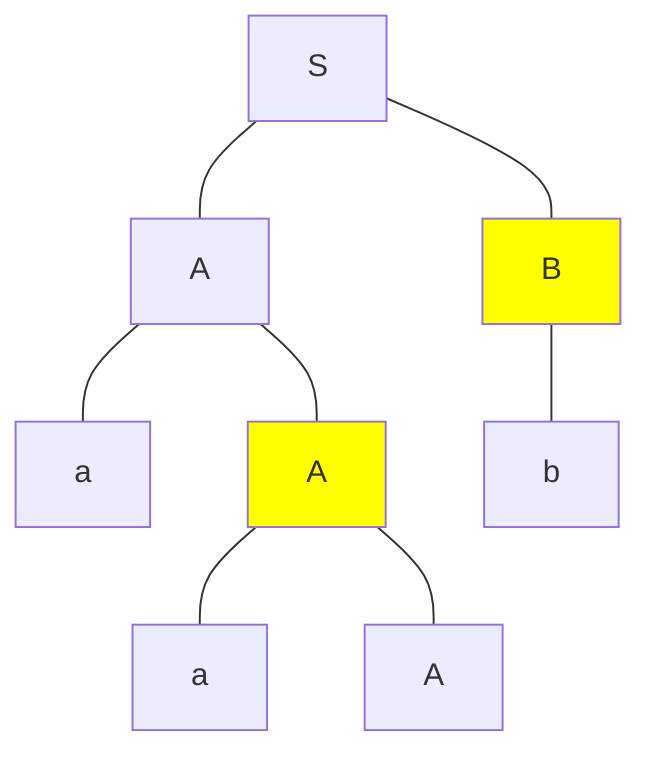
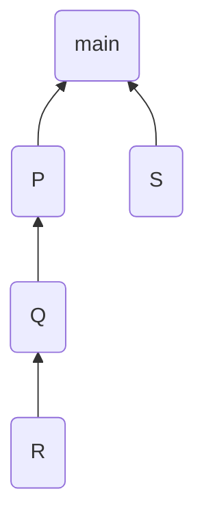

这是清华大学计算机系 2024 年秋季课程《编译原理》的期末复习笔记。

<!-- more -->

## 第一讲：课程概述

### T 型图

T 型图用于表示一个编译程序，其中

- S 是编译的源语言
- T 是编译的目标语言
- I 是用来实现编译程序的语言


当 I 与 T 相同时，称为**（M 机器上运行的）本地编译器**；当 I 与 T 不同时，称为**（M 机器上运行的）交叉编译器**。

多个 T 型图可以进行叠加，只需要保证相邻的 T-I 或者 I-S 相同即可。 L-(A)-B 加上 A-(M)-N 可以得到 L-(N)-B。


> 例：将机器 A 上的语言 L 移植到机器 B。即，我们现在有 L-(A)-A，我们需要构造一个 L-(B)-B。
>
> 
>
> 在上图中，红框部分不是必要相邻的。

## 第二讲：词法分析

我认为很有意思的是以下题目：

> 已知 Java 中的“注释”以 `/*` 开始，以 `*/` 结束，在 `/*` 和 `*/` 之间，除了 `*/` 序列外，可以出现任意字符。请构造一个正则表达式来匹配所有此类注释。

直接设计正则表达式是困难的；所以我先构造了一个 DFA，再转为正则表达式。



可以写出正则表达式为：
$$
/*\left(\left(\Sigma - \{*\}\right) + **^*\left(\Sigma - \{*, /\}\right)\right)^* **^*/
$$

## 第三讲：自顶向下语法分析

带回溯的自顶向下语法分析过程中存在两类非确定性：

1. 选择对哪一个非终结符进行展开；
2. 如果选定的非终结符是多个产生式的左部，那么应该选择使用哪一个产生式。

对于第一类非确定性而言，我们可以考虑**只允许最左推导或最右推导**来避免；对于第二类非确定性而言，我们可以考虑使用**自顶向下预测分析**：向前查看确定树木的单词符号，然后确定应该选择哪一个产生式进行最左推导。

### LL(1) 分析

LL(1) 是指，**L**eft-to-right, **L**eftmost derivation with **1** token of look-ahead。

对于 CFG $G = \{V_N, V_T, P, S\}$ 而言，我们一般想要研究
$$
X_G = V_N \cup V_T \cup \{\varepsilon\} \cup \{v \mid A \to u, v \text{ is a suffix of } u\}.
$$

#### First 集合

对于 CFG $G = \{V_N, V_T, P, S\}$ 而言，$\alpha \in (V_N \cup V_T)^*$ 的 First 集合的定义为
$$
\text{First}(\alpha) = \{a \mid \alpha \overset{*}{\implies}a\beta, a \in V_T, \beta \in (V_N \cup V_T)^*, \text{or } a = \varepsilon \text{ when } \alpha \overset{*}{\implies} \varepsilon\}.
$$
直观上来说，一个句型 $\alpha$ 若能够推导出另一个以终结符 $a$ 开头的句型，则 $a \in \text{First}(\alpha)$；若 $\alpha$ 可以推导出 $\varepsilon$，则 $\varepsilon \in \text{First}(\alpha)$。

**步骤**

- 初始化：对于所有 $x \in V_T\cup\{\varepsilon\}$，都有 $\text{First}(x) = \{x\}$；对于其他 $x$，都有 $\text{First}(x) = \varnothing$。
- 迭代：重复以下步骤，直至所有 First 集合均不变。
  - 对于 $y_1y_2\cdots y_k \in \{v \mid A \to u \in P, v \text{ is a suffix of } u\}$ 而言，
    - 若能找到 $i \in [1, k]$ 使得对于 $\forall j \in [1, i - 1]$ 都有 $\varepsilon \in \text{First}(y_j)$，且 $\varepsilon \notin \text{First}(y_i)$，则
      $$
      \text{First}(y_1y_2\cdots y_k) = \left(\bigcup_{1 \le j \le i}\text{First}(y_j)\right) - \{\varepsilon\}.
      $$
    - 否则
      $$
      \text{First}(y_1y_2\cdots y_k) = \bigcup_{1 \le j \le k}\text{First}(y_j).
      $$
  - 对所有 $A \to y_1y_2\cdots y_k \in P$，置
    $$
    \text{First}(A) \gets \text{First}(A) \cup \text{First}(y_1y_2\cdots y_k).
    $$

关键在于找到第一个满足 $\varepsilon \notin \text{First}(y_i)$ 的 $i$。它不能推导出 $\varepsilon$，说明从 $y_1y_2 \cdots y_k$ 推导出的句型的首字母：

- 前面的 $y_j$，不全推导为 $\varepsilon$，得到 $\bigcup_{1 \le j \le i - 1}\text{First}(y_j)$。
- 前面的 $y_j$ 全推导为 $\varepsilon$，得到 $\text{First}(y_i)$。

在 $y_i$ 的时候截断了——对于 $y_j, \forall j \ge i + 1$ 而言，它不会再对 $y_1y_2 \cdots y_k$ 的 First 集合产生贡献。

#### Follow 集合

对于 CFG $G = \{V_N, V_T, P, S\}$ 而言，$A \in V_N$ 的 Follow 集合的定义为
$$
\text{Follow}(A) = \{a \mid S\# \overset{*}{\implies} \alpha A \beta\#, a \in \text{First}(\beta\#), \alpha, \beta \in (V_N \cup V_T)^*\}.
$$

直观上来说，若 $G$ 中存在一个包含子串 $Aa$ 的句型，则 $a \in \text{Follow}(A)$；若 $G$ 中存在一个以 $A$ 结尾的句型，则 $\# \in \text{Follow}(A)$。

显然，一定有 $\# \in \text{Follow}(S)$。

**步骤**

- 初始化：$\text{Follow}(S) = \{\#\}$；对于其他的 $A \in V_N$，都有 $\text{Follow}(A) = \varnothing$。
- 迭代：重复以下步骤，直至所有 Follow 集合均不变。
  若有 $A \to \alpha B \beta \in P, \alpha, \beta \in (V_N \cup V_T)^*, B \in V_N$，则
  - $\text{Follow}(B) \gets \text{Follow}(B) \cup \left(\text{First}(\beta) - \{\varepsilon\}\right)$。
  - 若 $\varepsilon \in \text{First}(\beta)$，则 $\text{Follow}(B) \gets \text{Follow}(B) \cup \text{Follow}(A)$。

也就是说，对于所有产生式的右部的非终结符 $B$ 而言，设 $B$ 后面接着的是 $\beta$，那么 $\text{Follow}(B)$ 肯定要包含 $\text{First}(\beta) - \{\varepsilon\}$。另外，如果 $\varepsilon \in \text{First}(\beta)$，这说明 $A$ 可以推导出以 $B$ 为后缀的句型（此时让 $\beta \overset{*}{\implies}\varepsilon$）。那么，$A$ 后面能立即跟着的终结符，也能跟在 $B$ 的后面，所以 $\text{Follow}(B)$ 还需要包含 $\text{Follow}(A)$。

#### 预测集合 PS

对于 CFG $G = \{V_N, V_T, P, S\}$ 而言，$A \to \alpha \in P$ 的预测集合的定义为：

- 若 $\varepsilon \notin \text{First}(\alpha)$，则 $\text{PS}(A \to \alpha) = \text{First}(\alpha)$；
- 若 $\varepsilon \in \text{First}(\alpha)$，则 $\text{PS}(A \to \alpha) = (\text{First}(\alpha) - \{\varepsilon\}) \cup \text{Follow}(A)$。

直观上来说，$\text{PS}(A \to \alpha)$ 中的元素表示的是 LL(1) 分析过程中 $A$ 能和哪些终结符匹配：要么是匹配不含 $\varepsilon$ 的 $\text{First}(\alpha)$，要么是 $\alpha \overset{*}{\implies}\varepsilon$ 后匹配 $\text{Follow}(A)$。

$G$ 是 LL(1) 的，当且仅当对于 $G$ 中任意两个有相同左部的产生式 $A \to \alpha$ 和 $A \to \beta$，都满足 $\text{PS}(A \to \alpha) \cap \text{PS}(A \to \beta) = \varnothing$。

#### 预测分析表

如果 $A \to \alpha \in P$，则在 $S$ 行 $\text{PS}(A \to \alpha)$ 列的单元中写下 $\alpha$。

| 非终结符\终结符 |     $a$     |         $b$         |     $c$     |    $d$    | $\#$ |
| :-------------: | :---------: | :-----------------: | :---------: | :-------: | :--: |
|       $S$       | $S \to AaS$ |     $S \to BbS$     | $S \to BbS$ | $S \to d$ |      |
|       $A$       |  $A \to a$  |                     |             |           |      |
|       $B$       |             | $B \to \varepsilon$ |  $B \to c$  |           |      |

**表驱动 LL(1) 分析程序**

- 初始时栈中仅含 $\#$。然后将文法初始符号 $S$ 入栈。
- 迭代：重复以下步骤，直至栈顶为 $\#$ 且串当前字符也为 $\#$。
  - 若栈顶为非终结符，则弹出该终结符，依据串当前字符，在预测分析表中找到相应的产生式，**从上到下**将产生式右部放置于栈中。
  - 若栈顶为终结符，则检查是否与串当前字符匹配。

#### 消除左递归

**消除直接左递归**

对于文法
$$
P \to P\alpha_1 \mid P\alpha_2 \mid \cdots \mid P\alpha_m \mid \beta_1 \mid \beta_2 \mid \cdots \mid \beta_n
$$
而言，可以消除直接左递归，将产生式改写为：
$$
\begin{align*}
P & \to \beta_1Q \mid \beta_2Q \mid \cdots \mid \beta_n Q \\
Q & \to \alpha_1Q \mid \alpha_2Q \mid \cdots \mid \alpha_mQ \mid \varepsilon
\end{align*}
$$

一定不要忘记最后的 $\varepsilon$。

**消除间接左递归**

假设所有的非终结符有排序：$A_1, A_2, \cdots, A_k$，按照以下步骤消除所有的间接左递归：

- 对于每个 $A_i$，考虑位于它前面的 $A_j(1 \le j < i)$。用 $A_i \to \alpha_1r \mid \alpha_2r \mid \cdots \mid \alpha_tr$ 来反复替代 $A_i \to A_j r$ 的产生式，其中 $A_j \to \alpha_1 \mid \alpha_2 \mid \cdots \mid \alpha_t$。
- 消除关于 $A_i$ 的直接左递归。

> 例：设文法 $G[S]$ 为
> $$
> \begin{align*}
> S & \to PQ \mid a \\
> P & \to QS \mid b \\
> Q & \to SP \mid c
> \end{align*}
> $$
> 试变换该文法，得到一个等价的不含左递归的文法。假设非终结符排序为 $S, P, Q$。

顺序为：$P$ 被 $S$ 替换，$Q$ 被 $S$ 替换，$Q$ 被 $P$ 替换。

第一轮对 $S$ 进行操作后（实际上未发生变化）为：
$$
\begin{align*}
S & \to PQ \mid a \\
P & \to QS \mid b \\
Q & \to SP \mid c
\end{align*}
$$

第二轮对 $P$ 进行操作后（实际上未发生变化）为：
$$
\begin{align*}
S & \to PQ \mid a \\
P & \to QS \mid b \\
Q & \to SP \mid c
\end{align*}
$$

第三轮对 $Q$ 进行操作后（先替换 $S$，再替换 $P$）为：

- 先替换 $S$
  $$
  \begin{align*}
  S & \to PQ \mid a \\
  P & \to QS \mid b \\
  Q & \to PQP \mid aP \mid c
  \end{align*}
  $$
- 再替换 $P$
  $$
  \begin{align*}
  S & \to PQ \mid a \\
  P & \to QS \mid b \\
  Q & \to QSQP \mid bQP \mid aP \mid c
  \end{align*}
  $$
- 再消除直接左递归
  $$
  \begin{align*}
  S & \to PQ \mid a \\
  P & \to QS \mid b \\
  Q & \to bQPR \mid aPR \mid cR \\
  R & \to SQPR \mid \varepsilon
  \end{align*}
  $$

#### 提取左公因子

对于文法
$$
P \to \alpha\beta_1 \mid \alpha\beta_2 \mid \cdots \mid \alpha\beta_m \mid \gamma_1 \mid \gamma_2 \mid \cdots \mid \gamma_n
$$
而言，可以提取左公因子，将产生式改写为：
$$
\begin{align*}
P & \to \alpha Q \mid \gamma_1 \mid \gamma_2 \mid \cdots \mid \gamma_n \\
Q & \to \beta_1 \mid \beta_2 \mid \cdots \mid \beta_m
\end{align*}
$$

## 第四讲：符号表

### 开作用域和闭作用域

- 该点作用域为**当前作用域**，
- 当前作用域与包含它的程序单元所构成的作用域称为**开作用域**，
- 不属于开作用域的作用域称为**闭作用域**。

### 单符号表与多符号表

```pascal
const a = 25;
var x, y; // (1)
procedure p;
    var z;
    begin
        ...
    end;
procedure r;
    var x, s; // (2)
    procedure t;
        var v, x, y; // (3)
        begin
        	...
       	end;
    begin
    	... // here
   	end;
begin
	...
end;
```

对于单符号表而言，所有的嵌套的定义域共用一个全局符号表。此时符号表中有 `a`、(2) 处的 `x`、(1) 处的 `y`、`p`、`r`、`x`、`s`、`t`。

对于多符号表而言，每个作用域都有各自的符号表，用一个栈来维护。此时符号表的组织为：

| 栈中位置     | 作用域              | 符号集合                | 开/闭    |
| ------------ | ------------------- | ----------------------- | -------- |
| 栈底         | 全局作用域          | `a`、`x`、`y`、`p`、`r` | 开作用域 |
| 栈顶         | 过程 `r` 的作用域   | `x`、`s`、`t`           | 开作用域 

不在符号表中的作用域有：

| 栈中位置     | 作用域              | 符号集合                | 开/闭    |
| ------------ | ------------------- | ----------------------- | -------- |
| （不在栈中） | 过程 `p` 的作用域   | `z`                     | 闭作用域 |
| （不在栈中） | 过程 `t` 的作用域 3 | `v`、`x`、`y`           | 闭作用域 |

## 第五讲：自底向上语法分析

### 短语、直接短语、句柄

直观上来说，

- **短语**是指分析树中非叶节点对应的果实；
- **直接短语**是指高度（注意：高度是指到子树中最远叶节点的距离，而非深度）为 $1$ 的节点对应的果实；
- **句柄**是指分析树中最左侧的直接短语。

> 例：已知文法 $G[S]$：
> $$
> \begin{align*}
> S & \to AB \\
> A & \to aA \mid \varepsilon \\
> B & \to b \mid bB
> \end{align*}
> $$
> 试指出句型 $aaAb$ 的全部短语、直接短语、句柄。

画出 $aaAb$ 的分析树如下：



每个非叶节点对应果实对应一个短语，所以所有的短语如下：
$$
aaA, aA, b, aaAb
$$
高度为 $1$ 的为非叶节点（图中高亮的节点）对应直接短语：
$$
aA, b
$$
最左侧的直接短语为句柄：
$$
aA
$$
如果分析树不唯一，则短语、直接短语和句柄是**所有分析树对应结果的并集**。

### 移进-归约分析

移进-归约分析借助一个栈（称为下推栈或分析栈）来实现，拥有两种动作：移进（Shift）和归约（Reduce）。**移进**是指从输入序列中将一个单词符号移入分析栈，**归约**是指按照确定的方式对位于分析栈栈顶的短语进行归约。

#### 移进-归约分析中的冲突

- **移进-归约冲突**：不能确定下一步应该移进，还是应该归约。
- **归约-归约冲突**：不能确定下一步应该对栈顶的哪一个短语进行归约。

### LR 分析方法

LR 是指，**L**eft-to-right, **R**ightmost derivation。在 LR 分析中，归约是对栈顶**句柄**进行归约。在设计 LR 分析程序时，通常是做法是在分析栈中存放分析引擎的当前状态，这样的分析栈，我们称之为**状态栈**。

#### ACTION 表和 GOTO 表

- $\text{ACTION}[k, a] = \text{s}i$，**Shift**：将状态 $i$ 移进栈顶，且输入串指针指向下一输入符号。
- $\text{ACTION}[k, a] = \text{r}j$，**Reduce**：按第 $j$ 条产生式归约。
- $\text{GOTO}[i, A] = j$：若按照 $A \to \alpha$ 进行归约，则需要将栈顶的 $|\alpha|$ 个状态弹出，此时栈顶状态为 $i$，**不将其弹出**，再将状态 $j$ 移进栈顶。

如果同时含有状态栈和符号栈，则需要

- $\text{ACTION}[k, a] = \text{s}i$，**Shift**：将输入符号也移进符号栈栈顶。
- $\text{ACTION}[k, a] = \text{r}j$，**Reduce**：按第 $j$ 条产生式修改符号栈栈顶的符号。
- $\text{GOTO}[i, A] = j$：此时将符号 $A$ 伴随着状态 $j$ 移进栈顶。

### LR(0) 分析

LL(1) 是指，**L**eft-to-right, **L**eftmost derivation with **0** token of look-ahead。

#### 增广文法

对于 $G[S]$ 而言，构造 $G[S']$，添加 $S'\to S$ 使得开始符号不会出现在任何产生式的右部。可以证明，$G[S'] = G[S]$。

#### 活前缀

对于 CFG $G = \{V_N, V_T, P, S\}$ 而言，若 $S \overset{*}{\underset{\text{rm}}{\implies}} \alpha A w$ 且 $A \implies \beta$，其中 $\alpha, \beta \in (V_N \cup V_T)^*, w \in V_T^*$，即 $\beta$ 是右句型 $\alpha\beta w$ 的一个相对于非终结符 $A$ 的句柄，则 $\alpha\beta$ 的任何前缀 $\gamma$ 都是文法 $G$ 的**活前缀**。

直观上来说，$\gamma \in (V_N \cup V_T)^*$ 是活前缀，当且仅当存在 $w \in L(G)$，使得 $\gamma$ 恰好是针对 $w$ 的分析过程中，**某个时刻分析栈上的符号串**（$\#$ 除外）。**活前缀是某个右句型的前缀，且这个前缀的右侧不超过该句型的某个句柄。**它们的关系如下：

- 活前缀已经含有该句柄的全部符号：表明该句柄对应的产生式 $A \to \alpha$ 的右部 $\alpha$ 已经出现在栈顶。
- 活前缀只含该句柄的一部分符号：表明该句柄对应的产生式 $A \to \alpha_1\alpha_2$ 的右部的子串 $\alpha_1$ 已经出现在栈顶，期待从输入串中看到可以由 $\alpha_2$ 推导出的字符串。
- 活前缀不含有该句柄的任何符号：此时期待从输入串中看到该句柄对应的产生式 $A \to \alpha$ 的右部所推导出的符号串。

#### LR(0) 有限状态机

**项目**

项目（item）是指由产生式 $A \to xyz$ 得到的形如 $A \to x.yz$ 的式子，圆点标志着已分析过的串与该产生式匹配的位置。若 $A \to \varepsilon$，则唯一的 LR(0) 项目记作 $A \to .$。

根据圆点所在的位置和圆点后是终结符、非终结符或为空，把项目分为以下几种：

- 移进项目：形如 $A \to \alpha.a\beta$，其中 $a \in V_T, \alpha, \beta \in (V_N \cup V_T)^*$。
- 待约项目：形如 $A \to \alpha.B\beta$。
- 归约项目：形如 $A \to \alpha.$。
- 接受项目：形如 $S' \to S$。

**闭包**

LR(0) 有限状态机的每个状态是某个 LR(0) 项目集合 $I$ 的闭包 $\text{CLOSURE}(I)$。构造闭包的算法如下：

1. 设 $J \gets I$。
2. 迭代：重复以下步骤，直至 $J$ 不再变化：
   对于 $J$ 中的每个项目 $A \to \alpha.B\beta$ 和 $G$ 中的每个产生式 $B \to \gamma$，进行 $J \gets J \cup\{B \to .\gamma\}$。
3. $\text{CLOSURE}(I) = J$。

也就是对于 $I$ 中的每个项目而言，把**紧邻圆点右侧的非终结符**对应的所有产生式（将右部放在圆点右侧）都加进 $\text{CLOSURE}(I)$。

**初态**

初态为 $\text{CLOSURE}(\{S' \to S\})$。

**转移函数**

转移函数为
$$
\text{GO}(I, X) = \text{CLOSURE}(J),
$$
其中 $I$ 为某个由 LR(0) 有限状态机的状态，$X \in V_N \cup V_T$，$J = \{A \to \alpha X.\beta \mid A \to \alpha.X\beta \in I\}$。也就是说，$J$ 中的产生式，是  $I$ 中的产生式圆点向右移动一个文法符号 $X$ 得到的。而这条转移边的边权，即为 $X$。

**所有状态的集合**

求出 LR(0) 有限状态机的所有状态的集合 $C$ 的算法如下：

- 初始化 $C \gets \text{CLOSURE}(\{S' \to S\})$。
- 迭代：重复以下步骤，直至 $C$ 不再变化：
  对于 $C$ 中的每个项目集合 $I$ 和 $G$ 的文法符号 $X$，进行 $C \gets C \cup \text{GO}(I, X)$。

**总结**

使用该方法构造的 LR(0) 有限状态机可以看做是一个以 $V_N \cup V_T$ 为字母表的（省略了死状态的）DFA。**该 DFA 的语言是增广文法 $G[S']$ 的所有活前缀的集合。**

#### LR(0) 分析表

对于 ACTION 表而言：

- 若项目 $A \to \alpha.a\beta$ 属于 $I_k$，$\text{GO}(I_k, a) = I_j$，则置 $\text{ACTION}[k, a] = \text{s}j$。
- 若项目 $A \to \alpha.$ 属于 $I_k$，则**对任意终结符** $a$，置 $\text{ACTION}[k, a] = \text{r}j$，其中 $A \to \alpha$ 是第 $j$ 个产生式（注意：$S'\to S$ 是第 $0$ 个产生式）。
- 若项目 $S' \to S.$ 属于 $I_k$，则置 $\text{ACTION}[k, \#] = \text{acc}$，表示接受。

对于 GOTO 表而言：

- 如果 $\text{GO}(I_k, A) = I_j$，则记 $\text{GOTO}[k, A] = j$。

终结符 $a$ 对应列为 $\text{ACTION}[k, a]$，非终结符 $A$ 对应列为 $\text{GOTO}[k, A]$。

| 状态 |     $d$     |     $+$     |     $($     |     $)$     |     $\#$     | $E$  | $T$  |
| :--: | :---------: | :---------: | :---------: | :---------: | :----------: | :--: | :--: |
|  0   | $\text{s}3$ |             | $\text{s}4$ |             |              |  1   |  2   |
|  1   |             | $\text{s}6$ |             |             | $\text{acc}$ |      |      |
|  2   | $\text{r}2$ | $\text{r}2$ | $\text{r}2$ | $\text{r}2$ | $\text{r}2$  |      |      |
|  3   | $\text{r}4$ | $\text{r}4$ | $\text{r}4$ | $\text{r}4$ | $\text{r}4$  |      |      |
|  4   | $\text{s}3$ |             | $\text{s}4$ |             |              |  5   |  2   |
|  5   |             | $\text{s}6$ |             | $\text{s}7$ |              |      |      |
|  6   | $\text{s}3$ |             | $\text{s}4$ |             |              |      |  8   |
|  7   | $\text{r}3$ | $\text{r}3$ | $\text{r}3$ | $\text{r}3$ | $\text{r}3$  |      |      |
|  8   | $\text{r}1$ | $\text{r}1$ | $\text{r}1$ | $\text{r}1$ | $\text{r}1$  |      |      |

值得注意的是，由于每次对 $\text{r}j$ 的赋值都是“对任意终结符”而言的，所以，如果出现 $\text{r}j$，则是一行全部为 $\text{r}j$。

#### LR(0) 文法

如果 LR(0) 分析表中各个表项均无多重定义，则称该文法为一个 **LR(0) 文法**。或者，从 LR(0) 有限自动机的角度来看，每个状态（项目闭包）均需要满足：

- 不同时含有移进项目和归约项目（无移进-归约冲突）
- 不含有两个或两个以上归约项目（无归约-归约冲突）

需要额外注意的是，$S'\to S.$ 是**接受项目**，并非归约项目，它不会和其他归约项目或移进项目产生冲突。

### SLR(1) 分析

SLR(1) 是指，**S**imple **L**eft-to-right, **R**ightmost derivation with **1** token of look-ahead。

向前查看一个符号，利用 Follow 集合，可解决部分冲突：

- 如果每个状态的所有归约项中要归约的非终结符的 Follow 集合互不相交，则可以解决归约-归约冲突。
- 如果每个状态的所有归约项的非终结符的 Follow 集合与该状态的所有移进项目要移进的符号集互不相交，则可以解决移进-归约冲突。

#### SLR(1) 分析表

只需要修改构造 SLR(1) 分析表中对于归约项目的构造部分：

- 若项目 $A \to \alpha.$ 属于 $I_k$，则对 $a \in \text{Follow}(A)$，置 $\text{ACTION}[k, a] = \text{r}j$，其中 $A \to \alpha$ 是第 $j$ 个产生式（注意：$S'\to S$ 是第 $0$ 个产生式）。

此时就不一定会出现整行全为 $\text{r}j$ 的情况了——$\text{r}j$ 只会出现在 $\text{Follow}(A)$ 对应的终结符列，而且一行中可以既有 $\text{r}j$ 又有 $\text{s}i$。

#### SLR(1) 文法

如果 SLR(1) 分析表中各个表项均无多重定义，则称该文法为一个 **SLR(1) 文法**。或者，从 LR(0) 有限自动机的角度来看，每个状态（项目闭包）均需要满足：

- 对该状态的任何项目 $A \to \alpha.a\beta$，不存在 $B \to \gamma.$，使得 $a \in \text{Follow}(B)$，即不存在移进-归约冲突。
- 对该状态的任意两个项目 $A \to \alpha.$ 和 $B \to \beta.$，满足 $\text{Follow}(A) \cap \text{Follow}(B) = \varnothing$，即不存在归约-归约冲突。

直观上来说，前者是说，对于一个终结符，要么归约它，要么依据这个终结符进行移进；后者是说，对于一个终结符，不存在两种对于它的规约。其实移进-归约和归约-归约并不一定冲突——它们只会在对于相同终结符有不同解释的时候才会冲突。

### LR(1) 分析

LR(1) 是指，**L**eft-to-right, **R**ightmost derivation with **1** token of look-ahead。

Follow 集合缩小了归约范围，但它仍然不精确：一个输入符号属于所归约非终结符的 Follow 集合，未必就是句柄后可以跟的符号。

#### LR(1) 有限状态机

**项目**

LR(1) 项目是在 LR(0) 项目的基础上增加一个终结符（称为**向前搜索符**）得到的，形如
$$
A \to \alpha.\beta, a
$$
其中 $A \to \alpha.\beta$ 是一个 LR(0) 项目，$a \in V_T \cup \{\#\}$。向前搜索符表示**产生式右端完全匹配后所允许在余留符号串中的首个终结符**。

形如 $A \to \alpha., a$ 的 LR(1) 项目相当于 LR(0) 中的归约项目，但是只有当余留符号串的首个终结符是 $a$ 的时候才可以进行归约。

对于
$$
\begin{align*}
A & \to \alpha.\beta, a_1 \\
A & \to \alpha.\beta, a_2 \\
\vdots \\
A & \to \alpha.\beta, a_m \\
\end{align*}
$$
而言，可以简记为 $A \to \alpha.\beta, a_1/a_2/\cdots/a_m$。

**闭包**

LR(0) 有限状态机的每个状态是某个 LR(0) 项目集合 $I$ 的闭包 $\text{CLOSURE}(I)$。构造闭包的算法如下：

1. 设 $J \gets I$。
2. 迭代：重复以下步骤，直至 $J$ 不再变化：
   对于 $J$ 中的每个项目 $[A \to \alpha.B\beta, a]$ 和 $G$ 中的每个产生式 $B \to \gamma$，进行 $J \gets J \cup\{[B \to .\gamma, b]\}$，这里 $b \in \text{First}(\beta a)$。
3. $\text{CLOSURE}(I) = J$。

也就是对于 $I$ 中的每个项目而言，把**紧邻圆点右侧的非终结符**对应的所有产生式（将右部放在圆点右侧）都加进 $\text{CLOSURE}(I)$，这些产生式的向前搜索符是**非终结符后的句型 $\beta$ 和向前搜索符 $a$ 构成的句型 $\beta a$ 的 First 集合**。

**初态**

初态为 $\text{CLOSURE}(\{[S' \to S, \#]\})$。

**转移函数**

转移函数为
$$
\text{GO}(I, X) = \text{CLOSURE}(J),
$$
其中 $I$ 为某个由 LR(1) 有限状态机的状态，$X \in V_N \cup V_T$，$J = \{[A \to \alpha X.\beta, a] \mid [A \to \alpha.X\beta, a] \in I\}$。也就是说，$J$ 中的产生式，是  $I$ 中的产生式圆点向右移动一个文法符号 $X$ 得到的。而这条转移边的边权，即为 $X$。

**所有状态的集合**

求出 LR(1) 有限状态机的所有状态的集合 $C$ 的算法如下：

- 初始化 $C \gets \text{CLOSURE}(\{[S' \to S, \#]\})$。
- 迭代：重复以下步骤，直至 $C$ 不再变化：
  对于 $C$ 中的每个项目集合 $I$ 和 $G$ 的文法符号 $X$，进行 $C \gets C \cup \text{GO}(I, X)$。

#### LR(1) 分析表

对于 ACTION 表而言：

- 若项目 $[A \to \alpha.a\beta, b]$ 属于 $I_k$，$\text{GO}(I_k, a) = I_j$，则置 $\text{ACTION}[k, a] = \text{s}j$。
- 若项目 $[A \to \alpha., b]$ 属于 $I_k$，则置 $\text{ACTION}[k, b] = \text{r}j$，其中 $A \to \alpha$ 是第 $j$ 个产生式（注意：$S'\to S$ 是第 $0$ 个产生式）。
- 若项目 $[S' \to S., \#]$ 属于 $I_k$，则置 $\text{ACTION}[k, \#] = \text{acc}$，表示接受。

对于 GOTO 表而言：

- 如果 $\text{GO}(I_k, A) = I_j$，则记 $\text{GOTO}[k, A] = j$。

#### LR(1) 文法

如果 LR(1) 分析表中各个表项均无多重定义，则称该文法为一个 **LR(1) 文法**。或者，从 LR(1) 有限自动机的角度来看，每个状态（项目闭包）均需要满足：

- 对于每个状态，不能同时含有项目 $[A \to \alpha.a\beta, b]$ 和项目 $[B \to \gamma., a]$，即不存在移进-归约冲突；
- 对于每个状态，不能同时含有项目 $[A \to \alpha., a]$ 和项目 $[B \to \beta., a]$，即不存在归约-归约冲突。

### LALR(1) 分析

LALR(1) 是指，**L**ook-**A**head, **L**eft-to-right, **R**ightmost derivation with **1** token of look-ahead。

#### 芯和同芯状态

对于 LR(1) 项目 $[A \to \alpha.a\beta, b]$ 而言，把 $A \to \alpha.a\beta$ 称为它的**芯**。如果对于两个状态，它们各自所有项目的芯分别构成的集合是相同的，那么就称这两个状态为**同芯状态**。

#### LALR(1) 有限状态机

对于 LR(1) 有限状态机中的两个同芯状态，由 GO 函数得到的针对任何符号的状态仍然是同芯的，因此，我们可以对 GO 函数进行修改。

合并 LR(1) 有限状态机中的同芯状态，结合修改后的 GO 函数，即得 **LALR(1) 有限状态机**。

构造 LALR(1) 有限状态机**并不需要先构造出 LR(1) 有限状态机**，因为可以边构造边合并状态。

#### LALR(1) 分析表

LALR(1) 分析表的构造过程与 LR(1) 分析表的构造过程一样。

#### LALR(1) 文法

一个 LR(1) 文法，如果将其 LR(1) 有限状态机的同芯状态合并后所得到的 LALR(1) 有限状态机中的全部状态无归约-归约冲突，则该文法是一个 **LALR(1) 文法**。

只需要检查归约-归约冲突的原因是，合并同芯状态不会产生新的移进-归约冲突（因为移进项目和归约项目一定不同芯——它们圆点的位置都不同），但会产生新的归约-归约冲突。

### 二义文法的 LR 分析

可以手动规定一些符号的优先级和结合性，使得文法分析可以进行下去。具体而言，可以手动规定某些移进-归约冲突时应该是移进还是归约，手动规定某些归约-归约冲突时应该按照哪个产生式进行归约。

### LR 分析中的错误处理

将分析表中的每个空白项赋值为 $\text{e}j$，表示报第 $j$ 种错误，运行第 $j$ 种错误处理程序。 

## 第六讲：语法制导的语义计算基础

### 属性文法

在文法 $G[S]$ 的基础上，可以为文法符号关联有特定意义的**属性**，并为产生式关联对应的**语义动作**，这样的拓展后的文法称为**属性文法**。
$$
\begin{align*}
S & \to ABC & \{\text{if } (A.\text{num} = B.\text{num}) \text{ and } (B.\text{num} = C.\text{num}) \\
& & \text{then } \text{print}(\text{``Accepted!''}) \\
& & \text{else } \text{print}(\text{``Refused!''})\} \\
A & \to A_1 a & \{A.\text{num} := A_1.\text{num} + 1\} \\
A & \to a & \{A.\text{num} := 1\} \\
B & \to B_1b & \{B.\text{num} := B_1.\text{num} + 1\} \\
B & \to b & \{B.\text{num} := 1\} \\
C & \to C_1 c & \{C.\text{num} := C_1.\text{num} + 1\} \\
C & \to c & \{C.\text{num} := 1\} \\
\end{align*}
$$
形如 $b := f(c_1, c_2, \cdots, c_k)$ 的称为**语义动作**，其中 $f$ 是**语义函数**。语义动作也可以只含一个函数，例如 $f(c_1, c_2, \cdots, c_k)$。

形如 $X.a := Y.b$ 的语义动作称为**复写规则**。

#### 综合属性和继承属性

对于关联于产生式 $A \to \alpha B\beta$ 的语义动作 $X.v := f(\cdots)$ 而言：

- 若 $X$ 是 $A$，则称 $A.v$ 为**综合属性**，
- 若 $X$ 是 $B$，则称 $B.v$ 为**继承属性**。

从分析树的角度来看，综合属性由子节点向父节点转移；继承属性由父节点向子节点转移。

在遍历分析树进行语义计算的时候，通常可以构造一个**依赖图**（依赖于别人结果的属性，指向被依赖的属性），如果这个图是一个 DAG（**D**irected **A**cyclic **G**raph，有向无圈图），则可以按照任意一个拓扑排序的顺序进行计算。

#### S-属性文法

仅包含综合属性的属性文法称为 **S-属性文法**。

**基于 S-属性文法的语义计算**

基于 S-属性文法的语义计算是简单的，只需要每次对符号进行归约的时候，同时计算综合属性的值即可。

#### L-属性文法

一个属性文法称为 **L-属性文法**，当且仅当其中每一个产生式 $A \to X_1X_2 \cdots X_n$，其每个语义动作所涉及的属性或者是综合属性，或者是某个 $X_i(1 \le i \le n)$ 的继承属性，而这个继承属性只能依赖于：

1. $X_i$ 左边的符号 $X_1, X_2, \cdots, X_{i-1}$ 的属性；
2. $A$ 的继承属性。

可以看出，S-属性文法是一种特殊的 L-属性文法。直观上来说，属性信息按照以下方式进行传递：


**基于 L-属性文法的语义计算**

```c++
void visit(Node u) {
    for (Node v : children(u)) { // 从左到右遍历 u 的每个子节点
        v.calculate_INHERITED_attribute(); // 计算 v 的继承属性
        visit(v);
    }
    u.calculate_SYNTHESIZED_attribute(); // 计算 u 的综合属性
}
```

经过一遍深度优先搜索即可得到所有的综合属性和继承属性的值。

### 翻译模式

**翻译模式**在形式上类似于属性文法，但是它允许 $\{\cdots\}$ 括起来的语义动作出现在产生式右端的**任何位置**，以此显式地表达属性计算的次序。

#### S-翻译模式

S-翻译模式仅涉及综合属性，通常将语义动作集合置于相应产生式的末尾。

**基于 S-翻译模式的语义计算**

假设语义栈由向量 $v$ 表示，归约前栈顶位置为 $\text{top}$，栈上第 $i$ 个位置所对应符号的综合属性值 $x$ 用 $v[i].x$ 表示。为了明确表达语义栈上的操作，将
$$
A \to XYZ \quad \{A.a:= f(X.x, Y.y, Z.z)\}
$$
变换为
$$
A \to XYZ \quad \{v[\text{top} - 2].a := f(v[\text{top} - 2].x, v[\text{top} - 1].y, v[\text{top}].z)\}
$$

> **注意**：归约时，产生式右端从左到右在栈中是按照自顶到底的顺序排列的。

#### L-翻译模式

L-翻译模式既可以包含综合属性，又可以包含继承属性，但需要满足：

1. 产生式右部某个符号的继承属性的计算必须位于该符号之前，且语义动作不访问位于该语义动作右侧的符号的属性，仅依赖于该语义动作左侧的符号的属性（如果依赖于产生式左部的符号，则只能依赖于它的继承属性）。
2. 产生式左部非终结符的综合属性的计算只能在所用到的属性都已计算出来之后进行，通常将相应的语义动作置于产生式的末尾。

直观上来说，这是为了保证 DFS 遍历语法分析树的正确性。

**递归下降语义计算程序**

将 `ParseX( )` 修改一下，以 $X$ 的继承属性作为形式参数，综合属性作为返回值（不妨设 $X$ 仅有一个综合属性）。

假设 $B.\text{val}, S.\text{val}$ 是综合属性，$B.f, S.f$ 是继承属性。则
$$
\begin{align*}
S & \to \{B.f := S.f\} \quad B \quad \{S_1.f := S.f + 1\} \quad S_1 \quad \{S.\text{val} := B.\text{val} + S_1.\text{val}\}\\
S & \to \varepsilon
\end{align*}
$$
对应的语义计算子函数可以设计为：

```cpp
float ParseS(int f) {
    Sv;
    if (lookahead == '0' || lookahead == '1') {
        Bf = f;
        Bv = ParseB(Bf);
        S1f = f + 1;
        S1v = ParseS(S1f);
        Sv = Bv + S1v;
    } else if (lookahead == '#') {
        Sv = 0;
    } else {
        printf("Syntex error!");
    }
    return Sv;
}
```

#### 消除基础文法左递归

假设有如下翻译模式：
$$
\begin{align*}
A & \to A_1 Y & \{A.a := g(A_1.a, Y.y)\} \\
A & \to X & \{A.a := f(X.x)\}
\end{align*}
$$
消去关于 $A$ 的左递归，得：
$$
\begin{align*}
A & \to XR \\
R & \to YR \mid \varepsilon
\end{align*}
$$
再考虑语义动作，可以给 $R$ 一个综合属性 $R.s$ 和一个继承属性 $R.i$，翻译模式可以变换为
$$
\begin{align*}
A & \to X \quad \{R.i := f(X.x)\} \quad R \quad \{A.a := R.s\} \\
R & \to Y \quad \{R_1.i := g(R.i, Y.y)\} \quad R_1 \quad \{R.s := R_1.s\} \\
R & \to \varepsilon \quad \{R.s := R.i\}
\end{align*}
$$


#### 基于 L-翻译模式的自底向上语义计算

如果语义动作集中**仅包含综合属性的访问或赋值**，则只需要处理好嵌入在产生式中间的语义动作。对此，一种处理方法是：引入新的非终结符 $N$ 和产生式 $N \to \varepsilon$；把嵌入在产生式中间的语义动作集用 $N$ 代替，并把该动作集放在产生式 $N \to \varepsilon$ 后面。

例如，对于下列翻译模式：
$$
\begin{align*}
E & \to TR \\
R & \to +T \quad \{\text{print}(\text{``+''})\} \quad R_1 \\
R & \to -T \quad \{\text{print}(\text{``-''})\} \quad R_1 \\
R & \to \varepsilon \\
T & \to \underline{\text{num}} \quad \{\text{print}(\underline{\text{num}}.\text{val})\}\\
\end{align*}
$$
可以变换为
$$
\begin{align*}
E & \to TR \\
R & \to +TMR_1 \\
R & \to -TNR_1 \\
R & \to \varepsilon \\
T & \to \underline{\text{num}} \quad \{\text{print}(\underline{\text{num}}.\text{val})\}\\
M & \to \varepsilon \quad \{\text{print}(\text{``+''})\} \\
N & \to \varepsilon \quad \{\text{print}(\text{``-''})\}
\end{align*}
$$

然而，如果语义动作集中**有继承属性的访问或赋值**，情况则会复杂一些。由于在自底向上的语义计算过程中，只有综合属性会出现在语义栈上，所以继承属性的访问最终要落实到对某个综合属性值的访问。

例如，对于下列翻译模式：
$$
S \to aA \quad \{C.i := f(A.s)\} \quad C
$$
其中 $A.s$ 是 $A$ 的综合属性，$C.i$ 是 $C$ 的继承属性。此时 $A.s$ 固然在语义栈中——但是 $f(A.s)$ 并不在。所以需要引入新的非终结符 $M$，将以上翻译模式改写为：
$$
\begin{align*}
S & \to aA \quad \{M.i: = A.s\} \quad M \quad \{C.i := M.s\} \quad C \\
M & \to \varepsilon \quad \{M.s = f(M.i)\}
\end{align*}
$$
可以把 $M$ 看做成一个函数，它负责计算 $M.s \gets f(M.i)$，将一个继承属性转换为了综合属性，并存放在语义栈上。

但是，此时还需要再解决一个问题：避免不一致访问。考虑以下翻译模式：
$$
\begin{align*}
S & \to aA \quad \{C.i := A.s\} \quad C \\
S & \to bAB \quad \{C.i := A.s\} \quad C \\
C & \to c \quad \{C.s := g(C.i)\}
\end{align*}
$$

这里出现的问题是，当使用 $C \to c$ 进行归约的时候：

- $C.i$ 要么位于**次栈顶**，这是从第一个产生式得来的，$C$ 位于 $\text{top}$，$A$ 位于 $\text{top} - 1$。此时 $A.s$ 是 $v[\text{top} - 1].s$，位于**次栈顶**。 
- $C.i$ 要么位于**次次栈顶**，这是从第二个产生式得来的，$C$ 位于 $\text{top}$，$B$ 位于 $\text{top} - 1$，$A$ 位于 $\text{top} - 2$。此时 $A.s$ 是 $v[\text{top} - 2].s$，位于**次次栈顶**。

这样就不知道在显式写出语义栈访问的时候，最后一句产生式对应的语义动作究竟是 $v[\text{top}].s := g(v[\text{top} - 1].s)$ 还是 $v[\text{top}].s := g(v[\text{top} - 2].s)$ 了。

> **注意**：这里赋值式的左式为 $v[\text{top}].s$，是因为第三个产生式中归约前的 $c$ 位于 $\text{top}$，则 $C$ 位于 $\text{top}$。如果是 $C \to \varepsilon$，则归约后 $C$ 应位于 $\text{top} + 1$，需要写成 $v[\text{top} + 1].s := \cdots$。

一种可行的做法是引入新的非终结符 $M$，将以上翻译模式改写为
$$
\begin{align*}
S & \to aA \quad \{C.i := A.s\} \quad C \\
S & \to bAB \quad \{M.i := A.s\} \quad M \quad \{C.i := M.s\} \quad C \\
C & \to c \quad \{C.s := g(C.i)\} \\
M & \to \varepsilon \quad \{M.s := M.i\}
\end{align*}
$$

这样就将 $C.i$ 的位置统一于 $\text{top} - 1$ 处。

## 第七讲：静态语义分析与中间代码生成

### 静态语义分析

静态语义分析最基本的工作是检查程序结构的一致性或完整性，例如：

- 控制流检查（例如 `break` 语句必须在循环中等）
- 唯一性检查（例如标识符、枚举类型的元素是唯一的等）
- 名字的上下文相关性检查（例如变量在使用前必须经过声明、在外部不能访问私有变量等）
- 类型检查（例如 `void f(int *a);` 的函数在调用时不允许 `f(10);` 等）

#### 类型检查

`{` 和 `}` 需要加引号以区别于元符号：
$$
S \to \text{`\{'} \quad \{S_1.\text{inloop}:=S.\text{inloop}\} \quad S_1 \quad \text{`\}'} \quad \{S.\text{type} := S_1.\text{type}\}
$$

### 中间代码生成

综合属性 $D.\text{width}$ 和 $P.\text{width}$ 表示所申明变量所占的字节数。继承属性 $P.\text{offset}$ 和 $D.\text{offset}$ 表示相应程序单元起始位置在全局空间中的偏移量。 

综合属性 $\underline{\text{id}}.\text{place}$ 表示相应的名字对应的存储位置，这更像是“引用”，而不是指针或地址。综合属性 $E.\text{code}$ 表示对 $E$ 进行求值的 TAC 语句序列。

语义函数 $\text{gen}$ 的结果是生成一条 TAC 语句。语义函数 $\text{newtemp}$ 的作用是在符号表中新建一个从未使用过的名字，并返回该位置的存储位置。

$\mid\mid$ 是 TAC 语句序列之间的链接运算。

$$
E \to R \quad \{E.\text{place} := \text{newtemp}; E.\text{code}:=R.\text{code} \mid\mid \text{gen}(E.\text{place} \;\text{`}:=\text{'}\;R.\text{base}\;\text{`}[\text{'}\;R.\text{offs}\;\text{`}]\text{'})\}
$$

继承属性 $E.\text{true}$ 和 $E.\text{false}$ 分别代表 $E$ 为真核假时控制要转移到的程序位置，即标号。

#### 拉链

至此，已经有 L-翻译模式可以将布尔表达式和控制语句翻译为 TAC 语句序列；现在，介绍一种可以处理同样问题的 S-翻译模式。这种翻译模式用到以下树型和语义函数：

- 综合属性 $E.\text{truelist}$（真链）：链表中的元素表示一系列跳转语句的地址，这些跳转语句的目标语句标号是**体现** $E$ 为真的标号。
- 综合属性 $E.\text{falselist}$（假链）：链表中的元素表示一系列跳转语句的地址，这些跳转语句的目标语句标号是**体现** $E$ 为假的标号。
- 综合属性 $S.\text{nextlist}$（next 链）：链表中的元素表示一系列跳转语句的地址，这些跳转语句的目标语句标号是在执行序列中紧跟在 $S$ 之后的下一条 TAC 语句的地址。
- 综合属性 $N.\text{nextlist}$：仅含一个语句地址的链表，对应于处理到 $N$ 时的跳转语句。
- 综合属性 $S.\text{breaklist}$（break 链）：链表中的元素表示一系列跳转语句的地址，这些跳转语句的目标语句标号是跳出直接包围 $S$ 的 while 语句后的下一条 TAC 语句的地址。
- 综合属性 $M.\text{gotostm}$ 中记录处理到 $M$ 时下一条待生成语句的标号。
- 语义函数 $\text{makelist}(i)$，创建只有一个节点 $i$ 的表，对应于一条跳转语句的地址。
- 语义函数 $\text{merge}(p_1, p_2)$：链接两个链表 $p_1, p_2$，返回结果链表。
- 语义函数 $\text{backpatch}(p, i)$：将链表 $p$ 中每个元素所指向的跳转语句的标号置为 $i$。
- 语义函数 $\text{nextstm}$：返回下一条 TAC 语句的地址。
- 语义函数 $\text{emit}(\cdots)$：输出一条 TAC 语句，并使 $\text{nextstm}$ 加 $1$。

拉链的目的是**确定哪些行应被填上同样的出口语句行**——它们未来将被填上同一个数。

例如：
$$
\begin{align*}
E \to E_1 \lor M E_2 \quad & \{ \text{backpatch}(E_1.\text{falselist}, M.\text{gotostm}); \\
& E.\text{truelist}:= \text{merge}(E_1.\text{truelist}, E_2.\text{truelist}); \\
& E.\text{falselist} := E_2.\text{falselist}\}
\end{align*}
$$
由于这里是逻辑“或”运算，故 $E_1$ 或 $E_2$ 为真，都能够**体现** $E$ 为真，所以 $E.\text{truelist}$ 是 $E_1.\text{truelist}$ 和 $E_2.\text{truelist}$ 链接后的结果。类似地。$E_1$ 为假并不能说明什么；$E_2$ 为假能够**体现**出 $E$ 为假，所以 $E.\text{falselist}$ 是 $E_2.\text{falselist}$。

#### 代码回填

对于布尔表达式 $E=a<b\lor c<d\land e<f$ 为输入。

遍历到 $a<b$ 并归约的时候，得到 $E.\text{truelist}=\{0\}$，$E.\text{falselist}=\{1\}$，此时 $\text{nextstm}=2$。写下代码

```cpp
(0) if a < b goto _
(1) goto _
```

然后遍历 $\lor$ 和 $M$，得到 $M.\text{gotostm}=\{\text{nextstm}\} = \{2\}$，这个语义动作不对 $\text{nextstm}$ 加 $1$。

遍历到 $c<d$ 并归约的时候，得到 $E.\text{truelist}=\{2\}$，$E.\text{falselist}=\{3\}$，此时 $\text{nextstm} = 4$。

```cpp
(0) if a < b goto _
(1) goto _
(2) if c < d goto _
(3) goto _
```

然后遍历 $\land$ 和 $M$，得到 $M.\text{gotostm} = \{\text{nextstm}\} = \{4\}$。

遍历到 $e<f$ 并归约的时候，得到 $E.\text{truelist}=\{4\}$，$E.\text{falselist}=\{5\}$，此时 $\text{nextstm} = 6$。写下代码

```cpp
(0) if a < b goto _
(1) goto _
(2) if c < d goto _
(3) goto _
(4) if e < f goto _
(5) goto _
```

至此，拉链结束，开始准备代码回填。

归约 $\land$ 的时候，$E.\text{truelist} := E_2.\text{truelist} = \{4\}$，$E.\text{falselist} = \text{merge}(E_1.\text{falselist}, E_2.\text{falselist}) = \{3, 5\}$。然后将 $M.\text{gotostm}$ 中的标号（此例为 $4$）**回填**至 $E_1.\text{truelist}$ 中的标号（此例为 $2$）对应行末填空中。代码为

```cpp
(0) if a < b goto _
(1) goto _
(2) if c < d goto (4)
(3) goto _
(4) if e < f goto _
(5) goto _
```

归约 $\lor$ 的时候，$E.\text{falselist} := E_2.\text{falselist} = \{3, 5\}$，$E.\text{truelist} = \text{merge}(E_1.\text{truelist}, E_2.\text{truelist}) = \{0, 4\}$。然后将 $M.\text{gotostm}$ 中的标号（此例为 $2$）**回填**至 $E_1.\text{falselist}$ 中的标号（此例为 $1$）对应行末填空中。代码为

```cpp
(0) if a < b goto _
(1) goto (2)
(2) if c < d goto (4)
(3) goto _
(4) if e < f goto _
(5) goto _
```


处理完整个表达式 $E$ 之后，语句 (0) (3) (4) (5) 的目标语句标号仍未确定，但这些语句已被记录在 $E$ 的真链和假链之中。如果以后 $E$ 被归约，则这些位置也将被回填。

## 第八讲：运行时存储组织

程序运行时，栈从从**高地址**向**低地址**方向生长；堆与之相反。

### 嵌套函数定义中非局部量的访问

在 C 语言等不支持嵌套函数定义的程序设计语言中，非局部量只有全局变量，通常情况下可以分配在静态数据区。所以，这里以类 Pascal 语言为例，来讨论函数层面的非局部量的访问。

```pascal
program Main(I, O);
procedure P;
	procedure Q;
		procedure R;
			begin
				P;
            end;
        begin
        	R;
        end;
    begin
    	Q;
    end;
procedure S;
	begin
		P;
    end;
begin
	S;
end;
```

#### 静态链

**静态链**展示的是代码层次上，函数嵌套定义的层次关系。以上述代码为例，函数嵌套定义树如下：



所以，在任意一个函数 `P` 的调用中——即使可能的调用顺序是 `main` - `S` - `P` - `Q` - `R` - `P`（自函数调用栈栈底到栈顶）——栈顶的 `P` 的静态链属性（用 SL 表示）仍指向函数嵌套定义树中 `P` 的父节点 `main` 在函数调用栈中最近的那次调用。下图中展示了上述代码的静态链。


#### 动态链

**动态链**展示的是函数调用栈中的层次关系。动态链相对于静态链而言理解起来就容易许多，因为它和函数调用栈是类似的。在函数的活动记录中，动态链属性（用 DL 表示）指向的是**调用该函数的函数的栈帧的基地址**（基地址是最高地址，因为栈是由高地址向低地址生长的，分配空间也是从高往低按顺序分配）。


#### Display 表

采用静态链实现非局部量访问，需要沿静态链进行多次访存操作。另一种方法是采用全局 **Display 表**。Display 表中存储的是**静态链每一层中，最新活动记录的基地址**。


| calls |  S   |  P   |  Q   |  R   |  P'  |  Q'  |  R'  |
| :---: | :--: | :--: | :--: | :--: | :--: | :--: | :--: |
| D[3]  |  _   |  _   |  _   |  R   |  R   |  R   |  R'  |
| D[2]  |  _   |  _   |  Q   |  Q   |  Q   |  Q'  |  Q'  |
| D[1]  |  S   |  P   |  P   |  P   |  P'  |  P'  |  P'  |
| D[0]  | Main | Main | Main | Main | Main | Main | Main |
| saved |  _   |  S   |  _   |  _   |  P   |  Q   |  R   |

维护 Display 表的目的是得到 saved 数组。对于每个函数调用 calls 而言，**SL 的维护是由 calls 指向 saved**。

### 静态作用域规则和动态作用域规则

若遵循静态作用域规则，则要沿着过程活动记录的静态链（或 Display 表）查找最近一个过程中所声明的同名变量。在访问非局部变量的时候，如果 saved 并非 `_`，则由 calls 沿着 saved 进行查找；否则沿着调用栈在上一层中查找。

若遵循动态作用域规则，则要沿着过程活动记录的动态链（可理解为，函数调用栈）查找最近一个过程中所声明的同名变量。

## 第九讲：目标代码生成和代码优化基础

### 基本块、流图、循环

#### 基本块

**基本块**是指程序中一个顺序执行的语句序列，其中只有一个入口语句和一个出口语句。基本块的入口语句只有以下三种可能：

1. 程序的第 1 条语句；
2. 条件跳转语句或者无条件跳转语句的**目标语句**；
3. 条件跳转语句后面的相邻语句。

基本块就是从一个入口语句到下一个入口语句前的部分。

#### 流图

由基本块构成的有向图。$A$ 向 $B$ 连一条有向边，当且仅当程序在基本块 $A$ 执行完之后有可能执行基本块 $B$。

#### 循环

在流图中，如果从流图的首节点到 $v$ 的所有路径都必须经过 $u$，则称 $u$ 是 $v$ 的**支配节点**，记作 $u \text{ DOM } v$。流图中节点 $v$ 的所有支配节点的集合，称为 $v$ 的**支配节点集**，记作 $D(v)$。设 $n_0$ 是流图的首节点，则对于任意节点 $v$，一定有 $n_0 \in D(v)$ 和 $v \in D(v)$。

写出 $D(n) = \{\cdots, d, \cdots\}$，若有 $n \to d \in E$，则称 $n \to d$ 为 $E$ 的一条**回边**。

如果 $n \to d$ 是一条回边，则包含该回边的**自然循环**（简称**循环**）是由 $n$、$d$，以及有不经过 $d$ 到达 $n$ 的路径的所有节点构成。

### 数据流分析

正向数据流方程：
$$
\text{out}[S] = \text{gen}[S] \cup (\text{in}[S] - \text{kill}[S])
$$

反向数据流方程：
$$
\text{in}[S] = \text{gen}[S] \cup (\text{out}[S] - \text{kill}[S])
$$

#### 到达-定值数据流

对变量 $A$ 的**定值**（definition）是指一条 TAC 语句赋值或可能赋值给 $A$，该语句的位置称为 $A$ 的**定值点**。

称变量 $A$ 的定值点 $d$ **到达**某点 $p$，是指有路径从紧跟 $d$ 的点到达 $p$，且在这条路径上 $d$ 未被“杀死”，即该变量未被重新定值。直观上来说，是指流图中从 $d$ 有一条路径到达 $p$，且路径上没有 $A$ 的其他定值。我们定义：

- $\text{in}[B]$：到达基本块 $B$ 入口处（入口语句之前的位置）的各个变量的所有定值点的集合。
- $\text{out}[B]$：到达 $B$ 出口处（紧接着出口语句之后的位置）的各个变量的所有定值点的集合。
- $\text{gen}[B]$：$B$ 中定值的并能够到达 $B$ 出口出的所有定值点的集合。
- $\text{kill}[B]$：基本块 $B$ 外满足下列条件的定值点集合：这些定值点能够到达 $B$ 的入口处，但是所定值的变量在 $B$ 中被重新定值。

该数据流符合正向数据流方程：
$$
\text{out}[B] = \text{gen}[B] \cup (\text{in}[B] - \text{kill}[B])
$$

同时，还满足合流方恒：
$$
\text{in}[B] = \cup (\text{out}[b]), \quad b \in \text{P}[B]
$$
其中 $\text{P}[B]$ 是 $B$ 的前驱的集合。

设初值 $\text{in}[B] = \varnothing, \quad \forall B$，不停地按照以上两个方程进行迭代，即可得到最终稳定的解。

#### 活跃变量数据流

对程序中的某变量 $A$ 和某点 $p$ 而言，如果存在一条从 $p$ 开始的通路，其中引用了 $A$ 在 $p$ 点的值，则称 $A$ 在点 $p$ 是**活跃**的，否则称 $A$ 在 点 $p$ 是死亡的。我们定义：

- $\text{LiveIn}[B]$：$B$ 入口处活跃的变量的集合。
- $\text{LiveOut}[B]$：$B$ 出口处活跃的变量的集合。
- $\text{Def}[B]$：$B$ 中定值的，且定值前未曾在 $B$ 中引用过的变量的集合。
- $\text{LiveUse}[B]$：$B$ 中被定值之前的要引用的变量的集合。

该数据流符合反向数据流方程：
$$
\text{LiveIn}[B] = \text{LiveUse}[B] \cup (\text{LiveOut}[B] - \text{Def}[B])
$$

同时，还满足合流方程：
$$
\text{LiveOut}[B] = \cup(\text{LiveIn}[b]), \quad b \in \text{S}[B]
$$
其中 $\text{S}[B]$ 是 $B$ 的后继的集合。

设初值 $\text{LiveOut}[B] = \varnothing, \quad \forall B$，不停地按照以上两个方程进行迭代，即可得到最终稳定的解。

#### UD 链

假设在程序某点 $u$ 引用了变量 $A$ 的值，则把能到达 $u$ 的 $A$ 的所有定值点的全体，称为 $A$ 在引用点 $u$ 的**引用-定值链**（即 UD 链，**U**se-**D**efinition Chain）。

- 如果在基本块 $B$ 中，变量 $A$ 的引用点 $u$ 之前有 $A$ 的定值点 $d$，并且 $A$ 在 $d$ 的定值可以到达 $u$，那么 $A$ 在点 $u$ 的 UD 链就是 $\{d\}$；
- 如果在基本块中，变量 $A$ 的引用点 $u$ 之前没有 $A$ 的定值点，那么 $\text{in}[B]$ 中 $A$ 的所有定值点均到达 $u$，它们就是 $A$ 在点 $u$ 的 UD 链。

一句话总结：UD 链给出的是**某变量引用的所有可能的定值点**。

> **注意**：定值是会覆盖的。只考虑“最近”的那个定值点。

#### DU 链

假设在程序中某点 $p$ 定义了变量 $A$ 的值，从 $p$ 存在一条到达 $A$ 的某个引用点 $s$ 的路径，且该路径上不存在 $A$ 的其他定值点，则把所有此类引用点 $s$ 的全体称为 $A$ 在定值点 $p$ 的**定值-引用链**（即 DU 链，**D**efinition-**U**se Chain）。

一句话总结：DU 链给出的是**某变量定值的所有可能的引用点**。

#### 基本块内变量的待用信息

**待用信息**是用来跟踪变量在基本块内紧接着一次使用该变量的情况。

1. 初始化所有的 $\text{nextuse}(\cdot) = \varnothing$。
2. 迭代：从出口语句到入口语句，假设当前语句（$B$ 中的第 $i$ 条）为 $a := b + c$，**按顺序**进行以下操作：
   - 给 $a$ 标上 $\text{nextuse}(a)$。
   - $\text{nextuse}(a) \gets 0$。
   - 给 $b$ 和 $c$ 分别标上 $\text{nextuse}(b)$ 和 $\text{nextuse}(c)$。
   - $\text{nextuse}(b) \gets i, \text{nextuse}(c) \gets i$。

#### 基本块内变量的活跃信息

一个基本块中，如果某个变量 $A$ 在语句 $i$ 中被定值，在 $i$ 之后的语句 $j$ 中要引用 $A$ 的值，且 $i$ 到 $j$ 之间没有其他的对 $A$ 的定值点，则称 $A$ 在语句 $i$ 到 $j$ 之间是**活跃**的。

1. 初始化出口语句的活跃变量集合 $L \gets \text{LiveOut}[B]$。
2. 迭代：从出口语句到入口语句，假设当前语句为 $a := b + c$，**按顺序**进行以下操作：
   - $L \gets L - \{a\}$
   - $L \gets L \cup \{b, c\}$
   当前语句的活跃变量集合即为现在的 $L$。

一句话总结：从后往前，出口语句为 $\text{LiveOut}[B]$，每次迭代**先减去左端变量再加上右端变量**。

### 目标代码优化

#### 窥孔优化

**常量合并**

直接计算出常量表达式的结果。

例如，

```cpp
(1) r2 := 3 * 2
```

变为

```cpp
(1) r2 := 6
```

**常量传播**

所有引用常量变量的地方都显式地写出常量值。

例如，

```cpp
(1) r2 := 6
(2) r3 := r1 * r2
```

变为

```cpp
(1) r2 := 6
(2) r3 := r1 * 6
```

**强度削弱**

将高强度运算符改为低强度运算符。运算符强度：除法 > 乘法 > 移位运算 > 加减法。

例如，

```cpp
(1) x := 2.0 * f
```

变为

```cpp
(1) x := f + f
```

例如，

```cpp
(1) x := 32 * y
```

变为

```cpp
(1) x := y << 5
```

#### TAC 语句的 DAG


1. 对于 $x:=y \; \text{op}\;z$ 而言，如果 $\text{node}(y)$ 和 $\text{node}(z)$ 不存在，则新建它们。
2. 如果 $y$ 和 $z$ 都是常数，则新建 $\text{node}(x)$ 为计算结果的常数值。如果 $\text{node}(y)$ 或 $\text{node}(z)$ 是为了计算 $x$ 而新建的，则删去 $\text{node}(y)$ 或 $\text{node}(z)$。这一步起到了**常量合并**的作用。
3. 如果 $y$ 或 $z$ 不是常数，则检查是否存在某个标记为 $\text{op}$ 的节点，使得左孩子是 $\text{node}(y)$ 右孩子是 $\text{node}(z)$。若不存在，则新建该结点。这一步起到了**删除公共子表达式**的作用。
4. 最后，把 $x$ 从原来的 $\text{node}(x)$ 中删除，放到新的 $\text{node}(x)$ 中。这一步起到了**删除无用赋值**的作用。

考虑以下代码：

```cpp
(1) T0 := 3.14
(2) T1 := 2 * T0
(3) T2 := R + r
(4) A := T1 * T2
(5) B := A
(6) T3 := 2 * T0
(7) T4 := R + r
(8) T5 := T3 * T4
(9) T6 := R + r
(10) B := T5 * T6
```

则 DAG 构造如下：


最后按照 $n_1, n_2, \cdots, n_k$ 的构造顺序，重新写成 TAC 语句即可。

#### 代码外提

借助于 UD 链可以查找循环不变量，例如，对于循环内部的语句 $x:=y+z$，若 $y$ 和 $z$ 的定值点都在循环外，则 $x:=y+z$ 是循环不变量，可以将其外提。

具体而言，在流图中的循环的入口节点之前**新建一个前置节点**，用来放置所有被外提的代码。

> **注意**：循环不变量被外提的的条件是，它是**循环所有出口节点**的必经节点。以下是一个**无法进行代码外提**的例子：
>
> 
>
> 这里的 $i:=2$ 并不是循环中所有出口节点（例如，不是 $B_4$）的必经节点，所以无法外提。

#### 删除归纳变量

设有循环不变量 $C$，则称 $I:=I\pm C$ 中的 $I$为**基础归纳变量**，$J:=C_1 * I \pm C_2$ 中的 $J$ 为**归纳变量**，且称 $J$ 与 $I$ **同族**。

以下代码中 $x$ 是一个基本归纳变量，$i$ 是与 $x$ 同族的归纳变量。可以将代码进行如下改写：


#### Ershov 数

对于表达式树而言：

- 叶节点标为 $1$。
- 对于每个非叶节点：
  - 如果只有 $1$ 个子节点，则沿用该子节点的标记。
  - 如果两个子节点的标记**不同**，则取**较大者**。
  - 如果两个子节点的标记**相同**，则取子节点标记 $+1$。

对于节点 $u$ 而言，假设它的 Ershov 数为 $k$，则它使用寄存器 $R_0, R_1, \cdots, R_{k-1}$ 进行运算，然后把结果存到 $R_0$ 中。

#### 寄存器相干图

对于流图中的每个基本块中的每个定值语句，将其**定值变量**和当前语句时刻的**活跃集合中的所有变量**之间连边。
