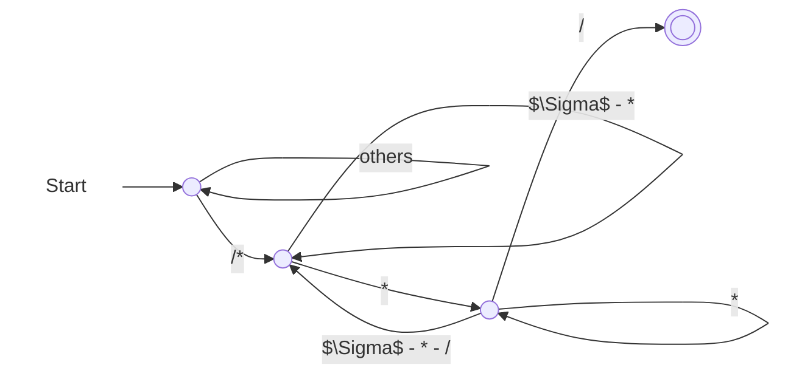
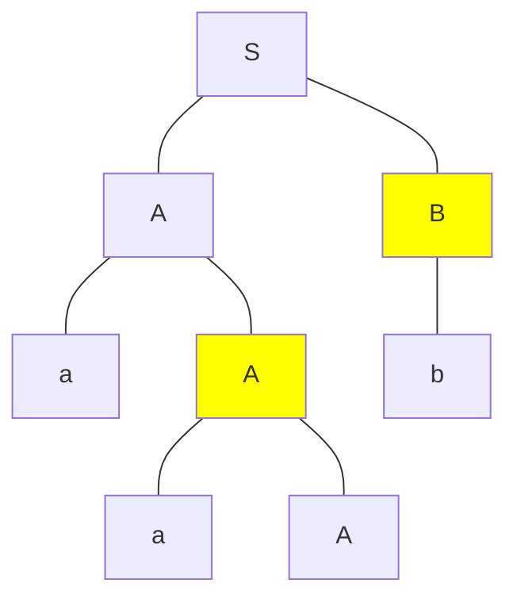

这是清华大学计算机系 2024 年秋季课程《编译原理》的期末复习笔记。

<!-- more -->

## 第一讲：课程概述

### T 型图


## 第二讲：词法分析

我认为很有意思的是以下题目：

> 已知 Java 中的“注释”以 `/*` 开始，以 `*/` 结束，在 `/*` 和 `*/` 之间，除了 `*/` 序列外，可以出现任意字符。请构造一个正则表达式来匹配所有此类注释。

直接设计正则表达式是困难的；所以我先构造了一个 DFA，再转为正则表达式。



可以写出正则表达式为：
$$
/*\left(\left(\Sigma - \{*\}\right) + **^*\left(\Sigma - \{*, /\}\right)\right)^* **^*/
$$

## 第三讲：自顶向下语法分析

带回溯的自顶向下语法分析过程中存在两类非确定性：

1. 选择对哪一个非终结符进行展开；
2. 如果选定的非终结符是多个产生式的左部，那么应该选择使用哪一个产生式。

对于第一类非确定性而言，我们可以考虑**只允许最左推导或最右推导**来避免；对于第二类非确定性而言，我们可以考虑使用**自顶向下预测分析**：向前查看确定树木的单词符号，然后确定应该选择哪一个产生式进行最左推导。

### LL(1) 分析

LL(1) 是指，**L**eft-to-right, **L**eftmost derivation with **1** token of look-ahead。

对于 CFG $G = \{V_N, V_T, P, S\}$ 而言，我们一般想要研究
$$
X_G = V_N \cup V_T \cup \{\varepsilon\} \cup \{v \mid A \to u, v \text{ is a suffix of } u\}.
$$

#### First 集合

对于 CFG $G = \{V_N, V_T, P, S\}$ 而言，$\alpha \in (V_N \cup V_T)^*$ 的 First 集合的定义为
$$
\text{First}(\alpha) = \{a \mid \alpha \overset{*}{\implies}a\beta, a \in V_T, \beta \in (V_N \cup V_T)^*, \text{or } a = \varepsilon \text{ when } \alpha \overset{*}{\implies} \varepsilon\}.
$$
直观上来说，一个句型 $\alpha$ 若能够推导出另一个以终结符 $a$ 开头的句型，则 $a \in \text{First}(\alpha)$；若 $\alpha$ 可以推导出 $\varepsilon$，则 $\varepsilon \in \text{First}(\alpha)$。

**步骤**

- 初始化：对于所有 $x \in V_T\cup\{\varepsilon\}$，都有 $\text{First}(x) = \{x\}$；对于其他 $x$，都有 $\text{First}(x) = \varnothing$。
- 迭代：重复以下步骤，直至所有 First 集合均不变。
  - 对于 $y_1y_2\cdots y_k \in \{v \mid A \to u \in P, v \text{ is a suffix of } u\}$ 而言，
    - 若能找到 $i \in [1, k]$ 使得 $\varepsilon \in \text{First}(y_j), \forall j \in [1, i - 1]$ 且 $\varepsilon \notin \text{First}(y_i)$，则
      $$
      \text{First}(y_1y_2\cdots y_k) = \left(\bigcup_{1 \le j \le i}\text{First}(y_j)\right) - \{\varepsilon\}.
      $$
    - 否则
      $$
      \text{First}(y_1y_2\cdots y_k) = \bigcup_{1 \le j \le k}\text{First}(y_j).
      $$
  - 对所有 $A \to y_1y_2\cdots y_k \in P$，置
    $$
    \text{First}(A) \gets \text{First}(A) \cup \text{First}(y_1y_2\cdots y_k).
    $$

关键在于找到第一个满足 $\varepsilon \notin \text{First}(y_i)$ 的 $i$。它不能推导出 $\varepsilon$，说明从 $y_1y_2 \cdots y_k$ 推导出的句型的首字母：

- 前面的 $y_j$，不全推导为 $\varepsilon$，得到 $\bigcup_{1 \le j \le i - 1}\text{First}(y_j)$。
- 前面的 $y_j$ 全推导为 $\varepsilon$，得到 $\text{First}(y_i)$。

在 $y_i$ 的时候截断了——对于 $y_j, \forall j \ge i + 1$ 而言，它不会再对 $y_1y_2 \cdots y_k$ 的 First 集合产生贡献。

#### Follow 集合

对于 CFG $G = \{V_N, V_T, P, S\}$ 而言，$A \in V_N$ 的 Follow 集合的定义为
$$
\text{Follow}(A) = \{a \mid S\# \overset{*}{\implies} \alpha A \beta\#, a \in \text{First}(\beta\#), \alpha, \beta \in (V_N \cup V_T)^*\}.
$$

直观上来说，若 $G$ 中存在一个包含子串 $Aa$ 的句型，则 $a \in \text{Follow}(A)$；若 $G$ 中存在一个以 $A$ 结尾的句型，则 $\# \in \text{Follow}(A)$。

显然，一定有 $\# \in \text{Follow}(S)$。

**步骤**

- 初始化：$\text{Follow}(S) = \{\#\}$；对于其他的 $A \in V_N$，都有 $\text{Follow}(A) = \varnothing$。
- 迭代：重复以下步骤，直至所有 Follow 集合均不变。
  若有 $A \to \alpha B \beta \in P, \alpha, \beta \in (V_N \cup V_T)^*, B \in V_N$，则
  - $\text{Follow}(B) \gets \text{Follow}(B) \cup \left(\text{First}(\beta) - \{\varepsilon\}\right)$。
  - 若 $\varepsilon \in \text{First}(\beta)$，则 $\text{Follow}(B) \gets \text{Follow}(B) \cup \text{Follow}(A)$。

也就是说，对于所有产生式的右部的非终结符 $B$ 而言，设 $B$ 后面接着的是 $\beta$，那么 $\text{Follow}(B)$ 肯定要包含 $\text{First}(\beta) - \{\varepsilon\}$。另外，如果 $\varepsilon \in \text{First}(\beta)$，这说明 $A$ 可以推导出以 $B$ 为后缀的句型（此时让 $\beta \overset{*}{\implies}\varepsilon$）。那么，$A$ 后面能立即跟着的终结符，也能跟在 $B$ 的后面，所以 $\text{Follow}(B)$ 还需要包含 $\text{Follow}(A)$。

#### 预测集合 PS

对于 CFG $G = \{V_N, V_T, P, S\}$ 而言，$A \to \alpha \in P$ 的预测集合的定义为：

- 若 $\varepsilon \notin \text{First}(\alpha)$，则 $\text{PS}(A \to \alpha) = \text{First}(\alpha)$；
- 若 $\varepsilon \in \text{First}(\alpha)$，则 $\text{PS}(A \to \alpha) = (\text{First}(\alpha) - \{\varepsilon\}) \cup \text{Follow}(A)$。

直观上来说，$\text{PS}(A \to \alpha)$ 中的元素表示的是 LL(1) 分析过程中 $A$ 能和哪些终结符匹配：要么是匹配不含 $\varepsilon$ 的 $\text{First}(\alpha)$，要么是 $\alpha \overset{*}{\implies}\varepsilon$ 后匹配 $\text{Follow}(A)$。

$G$ 是 LL(1) 的，当且仅当对于 $G$ 中任意两个有相同左部的产生式 $A \to \alpha$ 和 $A \to \beta$，都满足 $\text{PS}(A \to \alpha) \cap \text{PS}(A \to \beta) = \varnothing$。

#### 预测分析表

如果 $A \to \alpha \in P$，则在 $S$ 行 $\text{PS}(A \to \alpha)$ 列的单元中写下 $\alpha$。

| 非终结符\终结符 |     $a$     |         $b$         |     $c$     |    $d$    | $\#$ |
| :-------------: | :---------: | :-----------------: | :---------: | :-------: | :--: |
|       $S$       | $S \to AaS$ |     $S \to BbS$     | $S \to BbS$ | $S \to d$ |      |
|       $A$       |  $A \to a$  |                     |             |           |      |
|       $B$       |             | $B \to \varepsilon$ |  $B \to c$  |           |      |

**表驱动 LL(1) 分析程序**

- 初始时栈中仅含 $\#$。然后将文法初始符号 $S$ 入栈。
- 迭代：重复以下步骤，直至栈顶为 $\#$ 且串当前字符也为 $\#$。
  - 若栈顶为非终结符，则弹出该终结符，依据串当前字符，在预测分析表中找到相应的产生式，**从上到下**将产生式右部放置于栈中。
  - 若栈顶为终结符，则检查是否与串当前字符匹配。

#### 消除左递归

**消除直接左递归**

对于文法
$$
P \to P\alpha_1 \mid P\alpha_2 \mid \cdots \mid P\alpha_m \mid \beta_1 \mid \beta_2 \mid \cdots \mid \beta_n
$$
而言，可以消除直接左递归，将产生式改写为：
$$
\begin{align*}
P &\to \beta_1Q \mid \beta_2Q \mid \cdots \mid \beta_n Q \\
Q & \to \alpha_1Q \mid \alpha_2Q \mid \cdots \mid \alpha_mQ \mid \varepsilon
\end{align*}
$$

一定不要忘记最后的 $\varepsilon$。

**消除间接左递归**

假设所有的非终结符有排序：$A_1, A_2, \cdots, A_k$，按照以下步骤消除所有的间接左递归：

- 对于每个 $A_i$，考虑位于它前面的 $A_j(1 \le j < i)$。用 $A_i \to \alpha_1r \mid \alpha_2r \mid \cdots \mid \alpha_tr$ 来反复替代 $A_i \to A_j r$ 的产生式，其中 $A_j \to \alpha_1 \mid \alpha_2 \mid \cdots \mid \alpha_t$。
- 消除关于 $A_i$ 的直接左递归。

> 例：设文法 $G[S]$ 为
> $$
> \begin{align*}
> S &\to PQ \mid a \\
> P &\to QS \mid b \\
> Q &\to SP \mid c
> \end{align*}
> $$
> 试变换该文法，得到一个等价的不含左递归的文法。假设非终结符排序为 $S, P, Q$。

顺序为：$P$ 被 $S$ 替换，$Q$ 被 $S$ 替换，$Q$ 被 $P$ 替换。

第一轮对 $S$ 进行操作后（实际上未发生变化）为：
$$
\begin{align*}
S &\to PQ \mid a \\
P &\to QS \mid b \\
Q &\to SP \mid c
\end{align*}
$$

第二轮对 $P$ 进行操作后（实际上未发生变化）为：
$$
\begin{align*}
S &\to PQ \mid a \\
P &\to QS \mid b \\
Q &\to SP \mid c
\end{align*}
$$

第三轮对 $Q$ 进行操作后（先替换 $S$，再替换 $P$）为：

- 先替换 $S$
  $$
  \begin{align*}
  S &\to PQ \mid a \\
  P &\to QS \mid b \\
  Q &\to PQP \mid aP \mid c
  \end{align*}
  $$
- 再替换 $P$
  $$
  \begin{align*}
  S &\to PQ \mid a \\
  P &\to QS \mid b \\
  Q &\to QSQP \mid bQP \mid aP \mid c
  \end{align*}
  $$
- 再消除直接左递归
  $$
  \begin{align*}
  S &\to PQ \mid a \\
  P &\to QS \mid b \\
  Q &\to bQPR \mid aPR \mid cR \\
  R &\to SQPR \mid \varepsilon
  \end{align*}
  $$

#### 提取左公因子

对于文法
$$
P \to \alpha\beta_1 \mid \alpha\beta_2 \mid \cdots \mid \alpha\beta_m \mid \gamma_1 \mid \gamma_2 \mid \cdots \mid \gamma_n
$$
而言，可以提取左公因子，将产生式改写为：
$$
\begin{align*}
P & \to \alpha Q \mid \gamma_1 \mid \gamma_2 \mid \cdots \mid \gamma_n \\
Q & \to \beta_1 \mid \beta_2 \mid \cdots \mid \beta_m
\end{align*}
$$

## 第四讲：符号表

### 开作用域和闭作用域

- 该点作用域为**当前作用域**，
- 当前作用域与包含它的程序单元所构成的作用域称为**开作用域**，
- 不属于开作用域的作用域称为**闭作用域**。

### 单符号表与多符号表

```pascal
const a = 25;
var x, y; // (1)
procedure p;
    var z;
    begin
        ...
    end;
procedure r;
    var x, s; // (2)
    procedure t;
        var v, x, y; // (3)
        begin
        	...
       	end;
    begin
    	... // here
   	end;
begin
	...
end;
```

对于单符号表而言，所有的嵌套的定义域共用一个全局符号表。此时符号表中有 `a`、(2) 处的 `x`、(1) 处的 `y`、`p`、`r`、`x`、`s`、`t`。

对于多符号表而言，每个作用域都有各自的符号表，用一个栈来维护。此时符号表的组织为：

| 栈中位置     | 作用域              | 符号集合                | 开/闭    |
| ------------ | ------------------- | ----------------------- | -------- |
| 栈底         | 全局作用域          | `a`、`x`、`y`、`p`、`r` | 开作用域 |
| 栈顶         | 过程 `r` 的作用域   | `x`、`s`、`t`           | 开作用域 

不在符号表中的作用域有：

| 栈中位置     | 作用域              | 符号集合                | 开/闭    |
| ------------ | ------------------- | ----------------------- | -------- |
| （不在栈中） | 过程 `p` 的作用域   | `z`                     | 闭作用域 |
| （不在栈中） | 过程 `t` 的作用域 3 | `v`、`x`、`y`           | 闭作用域 |

## 第五讲：自底向上语法分析

### 短语、直接短语、句柄

直观上来说，

- **短语**是指分析树中非叶节点对应的果实；
- **直接短语**是指高度（注意：高度是指到子树中最远叶节点的距离，而非深度）为 $1$ 的节点对应的果实；
- **句柄**是指分析树中最左侧的直接短语。

> 例：已知文法 $G[S]$：
> $$
> \begin{align*}
> S & \to AB \\
> A & \to aA \mid \varepsilon \\
> B & \to b \mid bB
> \end{align*}
> $$
> 试指出句型 $aaAb$ 的全部短语、直接短语、句柄。

画出 $aaAb$ 的分析树如下：



每个非叶节点对应果实对应一个短语，所以所有的短语如下：
$$
aaA, aA, b, aaAb
$$
高度为 $1$ 的为非叶节点（图中高亮的节点）对应直接短语：
$$
aA, b
$$
最左侧的直接短语为句柄：
$$
aA
$$
如果分析树不唯一，则短语、直接短语和句柄是**所有分析树对应结果的并集**。

### 移进-归约分析

移进-归约分析借助一个栈（称为下推栈或分析栈）来实现，拥有两种动作：移进（Shift）和归约（Reduce）。**移进**是指从输入序列中将一个单词符号移入分析栈，**归约**是指按照确定的方式对位于分析栈栈顶的短语进行归约。

#### 移进-归约分析中的冲突

- **移进-归约冲突**：不能确定下一步应该移进，还是应该归约。
- **归约-归约冲突**：不能确定下一步应该对栈顶的哪一个短语进行归约。

### LR 分析方法

LR 是指，**L**eft-to-right, **R**ightmost derivation。在 LR 分析中，归约是对栈顶**句柄**进行归约。在设计 LR 分析程序时，通常是做法是在分析栈中存放分析引擎的当前状态，这样的分析栈，我们称之为**状态栈**。

#### ACTION 表和 GOTO 表

- $\text{ACTION}[k, a] = \text{s}i$，**Shift**：将状态 $i$ 移进栈顶，且输入串指针指向下一输入符号。
- $\text{ACTION}[k, a] = \text{r}j$，**Reduce**：按第 $j$ 条产生式归约。
- $\text{GOTO}[i, A] = j$：若按照 $A \to \alpha$ 进行归约，则需要将栈顶的 $|\alpha|$ 个状态弹出，此时栈顶状态为 $i$，**不将其弹出**，再将状态 $j$ 移进栈顶。

如果同时含有状态栈和符号栈，则需要

- $\text{ACTION}[k, a] = \text{s}i$，**Shift**：将输入符号也移进符号栈栈顶。
- $\text{ACTION}[k, a] = \text{r}j$，**Reduce**：按第 $j$ 条产生式修改符号栈栈顶的符号。
- $\text{GOTO}[i, A] = j$：此时将符号 $A$ 伴随着状态 $j$ 移进栈顶。

### LR(0) 分析

LL(1) 是指，**L**eft-to-right, **L**eftmost derivation with **0** token of look-ahead。

#### 增广文法

对于 $G[S]$ 而言，构造 $G[S']$，添加 $S'\to S$ 使得开始符号不会出现在任何产生式的右部。可以证明，$G[S'] = G[S]$。

#### 活前缀

对于 CFG $G = \{V_N, V_T, P, S\}$ 而言，若 $S \overset{*}{\underset{\text{rm}}{\implies}} \alpha A w$ 且 $A \implies \beta$，其中 $\alpha, \beta \in (V_N \cup V_T)^*, w \in V_T^*$，即 $\beta$ 是右句型 $\alpha\beta w$ 的一个相对于非终结符 $A$ 的句柄，则 $\alpha\beta$ 的任何前缀 $\gamma$ 都是文法 $G$ 的**活前缀**。

直观上来说，$\gamma \in (V_N \cup V_T)^*$ 是活前缀，当且仅当存在 $w \in L(G)$，使得 $\gamma$ 恰好是针对 $w$ 的分析过程中，**某个时刻分析栈上的符号串**（$\#$ 除外）。**活前缀是某个右句型的前缀，且这个前缀的右侧不超过该句型的某个句柄。**它们的关系如下：

- 活前缀已经含有该句柄的全部符号：表明该句柄对应的产生式 $A \to \alpha$ 的右部 $\alpha$ 已经出现在栈顶。
- 活前缀只含该句柄的一部分符号：表明该句柄对应的产生式 $A \to \alpha_1\alpha_2$ 的右部的子串 $\alpha_1$ 已经出现在栈顶，期待从输入串中看到可以由 $\alpha_2$ 推导出的字符串。
- 活前缀不含有该句柄的任何符号：此时期待从输入串中看到该句柄对应的产生式 $A \to \alpha$ 的右部所推导出的符号串。

#### LR(0) 有限状态机

**项目**

项目（item）是指由产生式 $A \to xyz$ 得到的形如 $A \to x.yz$ 的式子，圆点标志着已分析过的串与该产生式匹配的位置。若 $A \to \varepsilon$，则唯一的 LR(0) 项目记作 $A \to .$。

根据圆点所在的位置和圆点后是终结符、非终结符或为空，把项目分为以下几种：

- 移进项目：形如 $A \to \alpha.a\beta$，其中 $a \in V_T, \alpha, \beta \in (V_N \cup V_T)^*$。
- 待约项目：形如 $A \to \alpha.B\beta$。
- 归约项目：形如 $A \to \alpha.$。
- 接受项目：形如 $S' \to S$。

**闭包**

LR(0) 有限状态机的每个状态是某个 LR(0) 项目集合 $I$ 的闭包 $\text{CLOSURE}(I)$。构造闭包的算法如下：

1. 设 $J \gets I$。
2. 迭代：重复以下步骤，直至 $J$ 不再变化：
   对于 $J$ 中的每个项目 $A \to \alpha.B\beta$ 和 $G$ 中的每个产生式 $B \to \gamma$，进行 $J \gets J \cup\{B \to .\gamma\}$。
3. $\text{CLOSURE}(I) = J$。

也就是对于 $I$ 中的每个项目而言，把**紧邻圆点右侧的非终结符**对应的所有产生式（将右部放在圆点右侧）都加进 $\text{CLOSURE}(I)$。

**初态**

初态为 $\text{CLOSURE}(\{S' \to S\})$。

**转移函数**

转移函数为
$$
\text{GO}(I, X) = \text{CLOSURE}(J),
$$
其中 $I$ 为某个由 LR(0) 有限状态机的状态，$X \in V_N \cup V_T$，$J = \{A \to \alpha X.\beta \mid A \to \alpha.X\beta \in I\}$。也就是说，$J$ 中的产生式，是  $I$ 中的产生式圆点向右移动一个文法符号 $X$ 得到的。而这条转移边的边权，即为 $X$。

**所有状态的集合**

求出 LR(0) 有限状态机的所有状态的集合 $C$ 的算法如下：

- 初始化 $C \gets \text{CLOSURE}(\{S' \to S\})$。
- 迭代：重复以下步骤，直至 $C$ 不再变化：
  对于 $C$ 中的每个项目集合 $I$ 和 $G$ 的文法符号 $X$，进行 $C \gets C \cup \text{GO}(I, X)$。

**总结**

使用该方法构造的 LR(0) 有限状态机可以看做是一个以 $V_N \cup V_T$ 为字母表的（省略了死状态的）DFA。**该 DFA 的语言是增广文法 $G[S']$ 的所有活前缀的集合。**

#### LR(0) 分析表

对于 ACTION 表而言：

- 若项目 $A \to \alpha.a\beta$ 属于 $I_k$，$\text{GO}(I_k, a) = I_j$，则置 $\text{ACTION}[k, a] = \text{s}j$。
- 若项目 $A \to \alpha.$ 属于 $I_k$，则**对任意终结符** $a$，置 $\text{ACTION}[k, a] = \text{r}j$，其中 $A \to \alpha$ 是第 $j$ 个产生式（注意：$S'\to S$ 是第 $0$ 个产生式）。
- 若项目 $S' \to S.$ 属于 $I_k$，则置 $\text{ACTION}[k, \#] = \text{acc}$，表示接受。

对于 GOTO 表而言：

- 如果 $\text{GO}(I_k, A) = I_j$，则记 $\text{GOTO}[k, A] = j$。

终结符 $a$ 对应列为 $\text{ACTION}[k, a]$，非终结符 $A$ 对应列为 $\text{GOTO}[k, A]$。

| 状态 |     $d$     |     $+$     |     $($     |     $)$     |     $\#$     | $E$  | $T$  |
| :--: | :---------: | :---------: | :---------: | :---------: | :----------: | :--: | :--: |
|  0   | $\text{s}3$ |             | $\text{s}4$ |             |              |  1   |  2   |
|  1   |             | $\text{s}6$ |             |             | $\text{acc}$ |      |      |
|  2   | $\text{r}2$ | $\text{r}2$ | $\text{r}2$ | $\text{r}2$ | $\text{r}2$  |      |      |
|  3   | $\text{r}4$ | $\text{r}4$ | $\text{r}4$ | $\text{r}4$ | $\text{r}4$  |      |      |
|  4   | $\text{s}3$ |             | $\text{s}4$ |             |              |  5   |  2   |
|  5   |             | $\text{s}6$ |             | $\text{s}7$ |              |      |      |
|  6   | $\text{s}3$ |             | $\text{s}4$ |             |              |      |  8   |
|  7   | $\text{r}3$ | $\text{r}3$ | $\text{r}3$ | $\text{r}3$ | $\text{r}3$  |      |      |
|  8   | $\text{r}1$ | $\text{r}1$ | $\text{r}1$ | $\text{r}1$ | $\text{r}1$  |      |      |

值得注意的是，由于每次对 $\text{r}j$ 的赋值都是“对任意终结符”而言的，所以，如果出现 $\text{r}j$，则是一行全部为 $\text{r}j$。

#### LR(0) 文法

如果 LR(0) 分析表中各个表项均无多重定义，则称该文法为一个 **LR(0) 文法**。或者，从 LR(0) 有限自动机的角度来看，每个状态（项目闭包）均需要满足：

- 不同时含有移进项目和归约项目（无移进-归约冲突）
- 不含有两个或两个以上归约项目（无归约-归约冲突）

需要额外注意的是，$S'\to S.$ 是**接受项目**，并非归约项目，它不会和其他归约项目或移进项目产生冲突。

### SLR(1) 分析

SLR(1) 是指，**S**imple **L**eft-to-right, **R**ightmost derivation with **1** token of look-ahead。

向前查看一个符号，利用 Follow 集合，可解决部分冲突：

- 如果每个状态的所有归约项中要归约的非终结符的 Follow 集合互不相交，则可以解决归约-归约冲突。
- 如果每个状态的所有归约项的非终结符的 Follow 集合与该状态的所有移进项目要移进的符号集互不相交，则可以解决移进-归约冲突。

#### SLR(1) 分析表

只需要修改构造 SLR(1) 分析表中对于归约项目的构造部分：

- 若项目 $A \to \alpha.$ 属于 $I_k$，则对 $a \in \text{Follow}(A)$，置 $\text{ACTION}[k, a] = \text{r}j$，其中 $A \to \alpha$ 是第 $j$ 个产生式（注意：$S'\to S$ 是第 $0$ 个产生式）。

此时就不一定会出现整行全为 $\text{r}j$ 的情况了——$\text{r}j$ 只会出现在 $\text{Follow}(A)$ 对应的终结符列，而且一行中可以既有 $\text{r}j$ 又有 $\text{s}i$。

#### SLR(1) 文法

如果 SLR(1) 分析表中各个表项均无多重定义，则称该文法为一个 **SLR(1) 文法**。或者，从 LR(0) 有限自动机的角度来看，每个状态（项目闭包）均需要满足：

- 对该状态的任何项目 $A \to \alpha.a\beta$，不存在 $B \to \gamma.$，使得 $a \in \text{Follow}(B)$，即不存在移进-归约冲突。
- 对该状态的任意两个项目 $A \to \alpha.$ 和 $B \to \beta.$，满足 $\text{Follow}(A) \cap \text{Follow}(B) = \varnothing$，即不存在归约-归约冲突。

直观上来说，前者是说，对于一个终结符，要么归约它，要么依据这个终结符进行移进；后者是说，对于一个终结符，不存在两种对于它的规约。其实移进-归约和归约-归约并不一定冲突——它们只会在对于相同终结符有不同解释的时候才会冲突。

### LR(1) 分析

LR(1) 是指，**L**eft-to-right, **R**ightmost derivation with **1** token of look-ahead。

Follow 集合缩小了归约范围，但它仍然不精确：一个输入符号属于所归约非终结符的 Follow 集合，未必就是句柄后可以跟的符号。

#### LR(1) 有限状态机

**项目**

LR(1) 项目是在 LR(0) 项目的基础上增加一个终结符（称为**向前搜索符**）得到的，形如
$$
A \to \alpha.\beta, a
$$
其中 $A \to \alpha.\beta$ 是一个 LR(0) 项目，$a \in V_T \cup \{\#\}$。向前搜索符表示**产生式右端完全匹配后所允许在余留符号串中的首个终结符**。

形如 $A \to \alpha., a$ 的 LR(1) 项目相当于 LR(0) 中的归约项目，但是只有当余留符号串的首个终结符是 $a$ 的时候才可以进行归约。

对于
$$
\begin{align*}
A &\to \alpha.\beta, a_1 \\
A &\to \alpha.\beta, a_2 \\
\vdots \\
A &\to \alpha.\beta, a_m \\
\end{align*}
$$
而言，可以简记为 $A \to \alpha.\beta, a_1/a_2/\cdots/a_m$。

**闭包**

LR(0) 有限状态机的每个状态是某个 LR(0) 项目集合 $I$ 的闭包 $\text{CLOSURE}(I)$。构造闭包的算法如下：

1. 设 $J \gets I$。
2. 迭代：重复以下步骤，直至 $J$ 不再变化：
   对于 $J$ 中的每个项目 $[A \to \alpha.B\beta, a]$ 和 $G$ 中的每个产生式 $B \to \gamma$，进行 $J \gets J \cup\{[B \to .\gamma, b]\}$，这里 $b \in \text{First}(\beta a)$。
3. $\text{CLOSURE}(I) = J$。

也就是对于 $I$ 中的每个项目而言，把**紧邻圆点右侧的非终结符**对应的所有产生式（将右部放在圆点右侧）都加进 $\text{CLOSURE}(I)$，这些产生式的向前搜索符是**非终结符后的句型 $\beta$ 和向前搜索符 $a$ 构成的句型 $\beta a$ 的 First 集合**。

**初态**

初态为 $\text{CLOSURE}(\{[S' \to S, \#]\})$。

**转移函数**

转移函数为
$$
\text{GO}(I, X) = \text{CLOSURE}(J),
$$
其中 $I$ 为某个由 LR(1) 有限状态机的状态，$X \in V_N \cup V_T$，$J = \{[A \to \alpha X.\beta, a] \mid [A \to \alpha.X\beta, a] \in I\}$。也就是说，$J$ 中的产生式，是  $I$ 中的产生式圆点向右移动一个文法符号 $X$ 得到的。而这条转移边的边权，即为 $X$。

**所有状态的集合**

求出 LR(1) 有限状态机的所有状态的集合 $C$ 的算法如下：

- 初始化 $C \gets \text{CLOSURE}(\{[S' \to S, \#]\})$。
- 迭代：重复以下步骤，直至 $C$ 不再变化：
  对于 $C$ 中的每个项目集合 $I$ 和 $G$ 的文法符号 $X$，进行 $C \gets C \cup \text{GO}(I, X)$。

#### LR(1) 分析表

对于 ACTION 表而言：

- 若项目 $[A \to \alpha.a\beta, b]$ 属于 $I_k$，$\text{GO}(I_k, a) = I_j$，则置 $\text{ACTION}[k, a] = \text{s}j$。
- 若项目 $[A \to \alpha., b]$ 属于 $I_k$，则置 $\text{ACTION}[k, b] = \text{r}j$，其中 $A \to \alpha$ 是第 $j$ 个产生式（注意：$S'\to S$ 是第 $0$ 个产生式）。
- 若项目 $[S' \to S., \#]$ 属于 $I_k$，则置 $\text{ACTION}[k, \#] = \text{acc}$，表示接受。

对于 GOTO 表而言：

- 如果 $\text{GO}(I_k, A) = I_j$，则记 $\text{GOTO}[k, A] = j$。

#### LR(1) 文法

如果 LR(1) 分析表中各个表项均无多重定义，则称该文法为一个 **LR(1) 文法**。或者，从 LR(1) 有限自动机的角度来看，每个状态（项目闭包）均需要满足：

- 对于每个状态，不能同时含有项目 $[A \to \alpha.a\beta, b]$ 和项目 $[B \to \gamma., a]$，即不存在移进-归约冲突；
- 对于每个状态，不能同时含有项目 $[A \to \alpha., a]$ 和项目 $[B \to \beta., a]$，即不存在归约-归约冲突。

### LALR(1) 分析

LALR(1) 是指，**L**ook-**A**head, **L**eft-to-right, **R**ightmost derivation with **1** token of look-ahead。

#### 芯和同芯状态

对于 LR(1) 项目 $[A \to \alpha.a\beta, b]$ 而言，把 $A \to \alpha.a\beta$ 称为它的**芯**。如果对于两个状态，它们各自所有项目的芯分别构成的集合是相同的，那么就称这两个状态为**同芯状态**。

#### LALR(1) 有限状态机

对于 LR(1) 有限状态机中的两个同芯状态，由 GO 函数得到的针对任何符号的状态仍然是同芯的，因此，我们可以对 GO 函数进行修改。

合并 LR(1) 有限状态机中的同芯状态，结合修改后的 GO 函数，即得 **LALR(1) 有限状态机**。

构造 LALR(1) 有限状态机**并不需要先构造出 LR(1) 有限状态机**，因为可以边构造边合并状态。

#### LALR(1) 分析表

LALR(1) 分析表的构造过程与 LR(1) 分析表的构造过程一样。

#### LALR(1) 文法

一个 LR(1) 文法，如果将其 LR(1) 有限状态机的同芯状态合并后所得到的 LALR(1) 有限状态机中的全部状态无归约-归约冲突，则该文法是一个 **LALR(1) 文法**。

只需要检查归约-归约冲突的原因是，合并同芯状态不会产生新的移进-归约冲突（因为移进项目和归约项目一定不同芯——它们圆点的位置都不同），但会产生新的归约-归约冲突。

### 二义文法的 LR 分析

可以手动规定一些符号的优先级和结合性，使得文法分析可以进行下去。具体而言，可以手动规定某些移进-归约冲突时应该是移进还是归约，手动规定某些归约-归约冲突时应该按照哪个产生式进行归约。

### LR 分析中的错误处理

将分析表中的每个空白项赋值为 $\text{e}j$，表示报第 $j$ 种错误，运行第 $j$ 种错误处理程序。 

## 第六讲：语法制导的语义计算基础

### 属性文法

在文法 $G[S]$ 的基础上，可以为文法符号关联有特定意义的**属性**，并为产生式关联对应的**语义动作**，这样的拓展后的文法称为**属性文法**。
$$
\begin{align*}
S & \to ABC & \{\text{if } (A.\text{num} = B.\text{num}) \text{ and } (B.\text{num} = C.\text{num}) \\
& & \text{then } \text{print}(\text{``Accepted!''}) \\
& & \text{else } \text{print}(\text{``Refused!''})\} \\
A & \to A_1 a & \{A.\text{num} := A_1.\text{num} + 1\} \\
A & \to a & \{A.\text{num} := 1\} \\
B & \to B_1b & \{B.\text{num} := B_1.\text{num} + 1\} \\
B & \to b & \{B.\text{num} := 1\} \\
C & \to C_1 c & \{C.\text{num} := C_1.\text{num} + 1\} \\
C & \to c & \{C.\text{num} := 1\} \\
\end{align*}
$$
形如 $b := f(c_1, c_2, \cdots, c_k)$ 的称为**语义动作**，其中 $f$ 是**语义函数**。语义动作也可以只含一个函数，例如 $f(c_1, c_2, \cdots, c_k)$。

形如 $X.a := Y.b$ 的语义动作称为**复写规则**。

#### 综合属性和继承属性

对于关联于产生式 $A \to \alpha B\beta$ 的语义动作 $X.v := f(\cdots)$ 而言：

- 若 $X$ 是 $A$，则称 $A.v$ 为**综合属性**，
- 若 $X$ 是 $B$，则称 $B.v$ 为**继承属性**。

从分析树的角度来看，综合属性由子节点向父节点转移；继承属性由父节点向子节点转移。

在遍历分析树进行语义计算的时候，通常可以构造一个**依赖图**（依赖于别人结果的属性，指向被依赖的属性），如果这个图是一个 DAG（**D**irected **A**cyclic **G**raph，有向无圈图），则可以按照任意一个拓扑排序的顺序进行计算。

#### S-属性文法

仅包含综合属性的属性文法称为 **S-属性文法**。

**基于 S-属性文法的语义计算**

基于 S-属性文法的语义计算是简单的，只需要每次对符号进行归约的时候，同时计算综合属性的值即可。

#### L-属性文法

一个属性文法称为 **L-属性文法**，当且仅当其中每一个产生式 $A \to X_1X_2 \cdots X_n$，其每个语义动作所涉及的属性或者是综合属性，或者是某个 $X_i(1 \le i \le n)$ 的继承属性，而这个继承属性只能依赖于：

1. $X_i$ 左边的符号 $X_1, X_2, \cdots, X_{i-1}$ 的属性；
2. $A$ 的继承属性。

可以看出，S-属性文法是一种特殊的 L-属性文法。直观上来说，属性信息按照以下方式进行传递：


**基于 L-属性文法的语义计算**

```c++
void visit(Node u) {
    for (Node v : children(u)) {
        v.calculate_INHERITED_attribute();
        visit(v);
    }
    u.calculate_SYNTHESIZED_attribute();
}
```

经过一遍深度优先搜索即可得到所有的综合属性和继承属性的值。

### 翻译模式

**翻译模式**在形式上类似于属性文法，但是它允许 $\{\cdots\}$ 括起来的语义动作出现在产生式右端的任何位置，以此显式地表达属性计算的次序。

#### S-翻译模式


#### L-翻译模式

