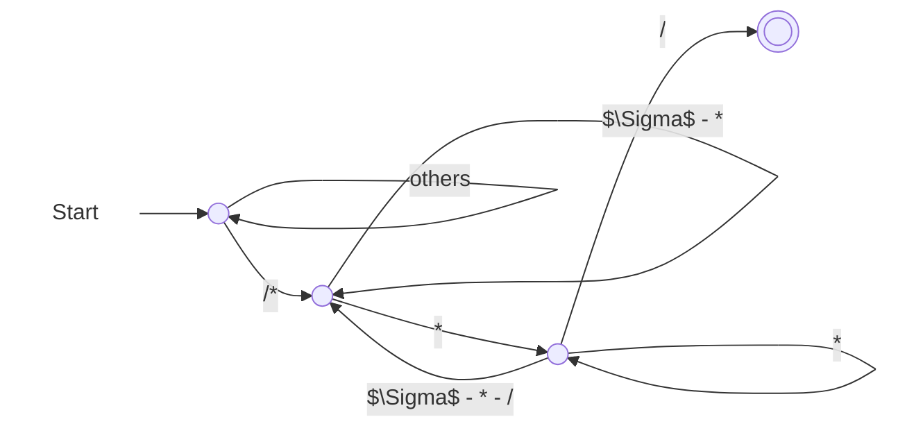

这是清华大学计算机系 2024 年秋季课程《编译原理》的期末复习笔记。

<!-- more -->

## 第一讲：课程概述

### T 型图


## 第二讲：词法分析

我认为很有意思的是以下题目：

> 已知 Java 中的“注释”以 `/*` 开始，以 `*/` 结束，在 `/*` 和 `*/` 之间，除了 `*/` 序列外，可以出现任意字符。请构造一个正则表达式来匹配所有此类注释。

直接设计正则表达式是困难的；所以我先构造了一个 DFA，再转为正则表达式。



可以写出正则表达式为：
$$
/*\left(\left(\Sigma - \{*\}\right) + **^*\left(\Sigma - \{*, /\}\right)\right)^* **^*/
$$

## 第三讲：自顶向下语法分析

带回溯的自顶向下语法分析过程中存在两类非确定性：

1. 选择对哪一个非终结符进行展开；
2. 如果选定的非终结符是多个产生式的左部，那么应该选择使用哪一个产生式。

对于第一类非确定性而言，我们可以考虑**只允许最左推导或最右推导**来避免；对于第二类非确定性而言，我们可以考虑使用**自顶向下预测分析**：向前查看确定树木的单词符号，然后确定应该选择哪一个产生式进行最左推导。

### LL(1) 分析

LL(1) 是指，**L**eft-to-right, **L**eftmost derivation with **1** token of lookahead。

对于 CFG $G = \{V_N, V_T, P, S\}$ 而言，我们一般想要研究
$$
X_G = V_N \cup V_T \cup \{\varepsilon\} \cup \{v \mid A \to u, v \text{ is a suffix of } u\}.
$$

#### First 集合

对于 CFG $G = \{V_N, V_T, P, S\}$ 而言，$\alpha \in (V_N \cup V_T)^*$ 的 First 集合的定义为
$$
\text{First}(\alpha) = \{a \mid \alpha \overset{*}{\implies}a\beta, a \in V_T, \beta \in (V_N \cup V_T)^*, \text{or } a = \varepsilon \text{ when } \alpha \overset{*}{\implies} \varepsilon\}.
$$
直观上讲，一个句型 $\alpha$ 若能够推导出另一个以终结符 $a$ 开头的句型，则 $a \in \text{First}(\alpha)$；若 $\alpha$ 可以推导出 $\varepsilon$，则 $\varepsilon \in \text{First}(\alpha)$。

**步骤**

- 初始化：对于所有 $x \in V_T\cup\{\varepsilon\}$，都有 $\text{First}(x) = \{x\}$；对于其他 $x$，都有 $\text{First}(x) = \varnothing$。
- 迭代：重复以下步骤，直至所有 First 集合均不变。
  - 对于 $y_1y_2\cdots y_k \in \{v \mid A \to u \in P, v \text{ is a suffix of } u\}$ 而言，
    - 若能找到 $i \in [1, k]$ 使得 $\varepsilon \in \text{First}(y_j), \forall j \in [1, i - 1]$ 且 $\varepsilon \notin \text{First}(y_i)$，则
      $$
      \text{First}(y_1y_2\cdots y_k) = \left(\bigcup_{1 \le j \le i}\text{First}(y_j)\right) - \{\varepsilon\}.
      $$
    - 否则
      $$
      \text{First}(y_1y_2\cdots y_k) = \bigcup_{1 \le j \le k}\text{First}(y_j).
      $$
  - 对所有 $A \to y_1y_2\cdots y_k \in P$，置
    $$
    \text{First}(A) \gets \text{First}(A) \cup \text{First}(y_1y_2\cdots y_k).
    $$

关键在于找到第一个满足 $\varepsilon \notin \text{First}(y_i)$ 的 $i$。它不能推导出 $\varepsilon$，说明从 $y_1y_2 \cdots y_k$ 推导出的句型的首字母：

- 前面的 $y_j$，不全推导为 $\varepsilon$，得到 $\bigcup_{1 \le j \le i - 1}\text{First}(y_j)$。
- 前面的 $y_j$ 全推导为 $\varepsilon$，得到 $\text{First}(y_i)$。

在 $y_i$ 的时候截断了——对于 $y_j, \forall j \ge i + 1$ 而言，它不会再对 $y_1y_2 \cdots y_k$ 的 First 集合产生贡献。

#### Follow 集合

对于 CFG $G = \{V_N, V_T, P, S\}$ 而言，$A \in V_N$ 的 Follow 集合的定义为
$$
\text{Follow}(A) = \{a \mid S\# \overset{*}{\implies} \alpha A \beta\#, a \in \text{First}(\beta\#), \alpha, \beta \in (V_N \cup V_T)^*\}.
$$

直观上讲，若 $G$ 中存在一个包含子串 $Aa$ 的句型，则 $a \in \text{Follow}(A)$；若 $G$ 中存在一个以 $A$ 结尾的句型，则 $\# \in \text{Follow}(A)$。

显然，一定有 $\# \in \text{Follow}(S)$。

**步骤**

- 初始化：$\text{Follow}(S) = \{\#\}$；对于其他的 $A \in V_N$，都有 $\text{Follow}(A) = \varnothing$。
- 迭代：重复以下步骤，直至所有 Follow 集合均不变。
  若有 $A \to \alpha B \beta \in P, \alpha, \beta \in (V_N \cup V_T)^*, B \in V_N$，则
  - $\text{Follow}(B) \gets \text{Follow}(B) \cup \left(\text{First}(\beta) - \{\varepsilon\}\right)$。
  - 若 $\varepsilon \in \text{First}(\beta)$，则 $\text{Follow}(B) \gets \text{Follow}(B) \cup \text{Follow}(A)$。

也就是说，对于所有产生式的右部的非终结符 $B$ 而言，设 $B$ 后面接着的是 $\beta$，那么 $\text{Follow}(B)$ 肯定要包含 $\text{First}(\beta) - \{\varepsilon\}$。另外，如果 $\varepsilon \in \text{First}(\beta)$，这说明 $A$ 可以推导出以 $B$ 为后缀的句型（此时让 $\beta \overset{*}{\implies}\varepsilon$）。那么，$A$ 后面能立即跟着的终结符，也能跟在 $B$ 的后面，所以 $\text{Follow}(B)$ 还需要包含 $\text{Follow}(A)$。

#### 预测集合 PS

对于 CFG $G = \{V_N, V_T, P, S\}$ 而言，$A \to \alpha \in P$ 的预测集合的定义为：

- 若 $\varepsilon \notin \text{First}(\alpha)$，则 $\text{PS}(A \to \alpha) = \text{First}(\alpha)$；
- 若 $\varepsilon \in \text{First}(\alpha)$，则 $\text{PS}(A \to \alpha) = (\text{First}(\alpha) - \{\varepsilon\}) \cup \text{Follow}(A)$。

直观上来讲，$\text{PS}(A \to \alpha)$ 中的元素表示的是 LL(1) 分析过程中 $A$ 能和哪些终结符匹配：要么是匹配不含 $\varepsilon$ 的 $\text{First}(\alpha)$，要么是 $\alpha \overset{*}{\implies}\varepsilon$ 后匹配 $\text{Follow}(A)$。

$G$ 是 LL(1) 的，当且仅当对于 $G$ 中任意两个有相同左部的产生式 $A \to \alpha$ 和 $A \to \beta$，都满足 $\text{PS}(A \to \alpha) \cap \text{PS}(A \to \beta) = \varnothing$。

#### 预测分析表

如果 $A \to \alpha \in P$，则在 $S$ 行 $\text{PS}(A \to \alpha)$ 列的单元中写下 $\alpha$。

| 非终结符\终结符 |     $a$     |         $b$         |     $c$     |    $d$    | $\#$ |
| :-------------: | :---------: | :-----------------: | :---------: | :-------: | :--: |
|       $S$       | $S \to AaS$ |     $S \to BbS$     | $S \to BbS$ | $S \to d$ |      |
|       $A$       |  $A \to a$  |                     |             |           |      |
|       $B$       |             | $B \to \varepsilon$ |  $B \to c$  |           |      |

**表驱动 LL(1) 分析程序**

- 初始时栈中仅含 $\#$。然后将文法初始符号 $S$ 入栈。
- 迭代：重复以下步骤，直至栈顶为 $\#$ 且串当前字符也为 $\#$。
  - 若栈顶为非终结符，则弹出该终结符，依据串当前字符，在预测分析表中找到相应的产生式，**从上到下**将产生式右部放置于栈中。
  - 若栈顶为终结符，则检查是否与串当前字符匹配。

#### 消除左递归

**消除直接左递归**

对于文法
$$
P \to P\alpha_1 \mid P\alpha_2 \mid \cdots \mid P\alpha_m \mid \beta_1 \mid \beta_2 \mid \cdots \mid \beta_n
$$
而言，可以消除直接左递归，将产生式改写为：
$$
\begin{align*}
P &\to \beta_1Q \mid \beta_2Q \mid \cdots \mid \beta_n Q \\
Q & \to \alpha_1Q \mid \alpha_2Q \mid \cdots \mid \alpha_mQ \mid \varepsilon
\end{align*}
$$

一定不要忘记最后的 $\varepsilon$。

**消除间接左递归**

假设所有的非终结符有排序：$A_1, A_2, \cdots, A_k$，按照以下步骤消除所有的间接左递归：

- 对于每个 $A_i$，考虑位于它前面的 $A_j(1 \le j < i)$。用 $A_i \to \alpha_1r \mid \alpha_2r \mid \cdots \mid \alpha_tr$ 来反复替代 $A_i \to A_j r$ 的产生式，其中 $A_j \to \alpha_1 \mid \alpha_2 \mid \cdots \mid \alpha_t$。
- 消除关于 $A_i$ 的直接左递归。

> 例：设文法 $G[S]$ 为
> $$
> \begin{align*}
> S &\to PQ \mid a \\
> P &\to QS \mid b \\
> Q &\to SP \mid c
> \end{align*}
> $$
> 试变换该文法，得到一个等价的不含左递归的文法。假设非终结符排序为 $S, P, Q$。

顺序为：$P$ 被 $S$ 替换，$Q$ 被 $S$ 替换，$Q$ 被 $P$ 替换。

第一轮对 $S$ 进行操作后（实际上未发生变化）为：
$$
\begin{align*}
S &\to PQ \mid a \\
P &\to QS \mid b \\
Q &\to SP \mid c
\end{align*}
$$

第二轮对 $P$ 进行操作后（实际上未发生变化）为：
$$
\begin{align*}
S &\to PQ \mid a \\
P &\to QS \mid b \\
Q &\to SP \mid c
\end{align*}
$$

第三轮对 $Q$ 进行操作后（先替换 $S$，再替换 $P$）为：

- 先替换 $S$
  $$
  \begin{align*}
  S &\to PQ \mid a \\
  P &\to QS \mid b \\
  Q &\to PQP \mid aP \mid c
  \end{align*}
  $$
- 再替换 $P$
  $$
  \begin{align*}
  S &\to PQ \mid a \\
  P &\to QS \mid b \\
  Q &\to QSQP \mid bQP \mid aP \mid c
  \end{align*}
  $$
- 再消除直接左递归
  $$
  \begin{align*}
  S &\to PQ \mid a \\
  P &\to QS \mid b \\
  Q &\to bQPR \mid aPR \mid cR \\
  R &\to SQPR \mid \varepsilon
  \end{align*}
  $$

#### 提取左公因子

对于文法
$$
P \to \alpha\beta_1 \mid \alpha\beta_2 \mid \cdots \mid \alpha\beta_m \mid \gamma_1 \mid \gamma_2 \mid \cdots \mid \gamma_n
$$
而言，可以提取左公因子，将产生式改写为：
$$
\begin{align*}
P & \to \alpha Q \mid \gamma_1 \mid \gamma_2 \mid \cdots \mid \gamma_n \\
Q & \to \beta_1 \mid \beta_2 \mid \cdots \mid \beta_m
\end{align*}
$$

## 第四讲：符号表

### 开作用域和闭作用域

- 该点作用域为**当前作用域**
- 当前作用域与包含它的程序单元所构成的作用域称为**开作用域**
- 不属于开作用域的作用域称为**闭作用域**

### 单符号表与多符号表

```pascal
const a = 25;
var x, y; // (1)
procedure p;
    var z;
    begin
        ...
    end;
procedure r;
    var x, s; // (2)
    procedure t;
        var v, x, y; // (3)
        begin
        	...
       	end;
    begin
    	... // here
   	end;
begin
	...
end;
```

对于单符号表而言，所有的嵌套的定义域共用一个全局符号表。此时符号表中有 `a`、(2) 处的 `x`、(1) 处的 `y`、`p`、`r`、`x`、`s`、`t`。

对于多符号表而言，每个作用域都有各自的符号表，用一个栈来维护。此时符号表的组织为：

| 栈中位置     | 作用域              | 符号集合                | 开/闭    |
| ------------ | ------------------- | ----------------------- | -------- |
| 栈底         | 全局作用域          | `a`、`x`、`y`、`p`、`r` | 开作用域 |
| 栈顶         | 过程 `r` 的作用域   | `x`、`s`、`t`           | 开作用域 |
| （不在栈中） | 过程 `p` 的作用域   | `z`                     | 闭作用域 |
| （不在栈中） | 过程 `t` 的作用域 3 | `v`、`x`、`y`           | 闭作用域 |

## 第五讲：自底向上语法分析

